# Agentic AI Architectures - Comprehensive Reference Guide

A practical guide to the most important agentic design patterns used in modern AI systems. Each architecture includes a description, when to use it, key benefits, a Mermaid diagram, and notebooks in mini-projects folder for practical explanations.

---

## Table of Contents

1. [Single Agent (ReAct)](#1-single-agent-react)
2. [Prompt Chaining](#2-prompt-chaining)
3. [Routing](#3-routing)
4. [Parallelization](#4-parallelization)
5. [Orchestrator-Worker](#5-orchestrator-worker)
6. [Supervisor (Hierarchical)](#6-supervisor-hierarchical)
7. [Reflection / Self-Correction](#7-reflection--self-correction)
8. [Evaluator-Optimizer](#8-evaluator-optimizer)
9. [Swarm (Decentralized Handoff)](#9-swarm-decentralized-handoff)
10. [Hierarchical Multi-Agent Teams](#10-hierarchical-multi-agent-teams)
11. [Architecture Selection Guide](#architecture-selection-guide)

---

## 1. Single Agent (ReAct)

### Description

The **ReAct (Reasoning + Acting)** pattern is the foundational agentic architecture. A single LLM alternates between **thinking** (reasoning about what to do) and **acting** (calling tools or producing output) in a loop. The agent continues this think-act cycle until it determines the task is complete.

### When to Use

- Tasks that require a single agent with access to tools (search, calculator, APIs)
- Simple question-answering with tool augmentation
- When the problem scope is narrow enough for one agent to handle
- Prototyping and getting started with agentic systems

### Benefits

| Benefit | Description |
|---|---|
| **Simplicity** | Easiest pattern to implement and debug |
| **Transparency** | Chain-of-thought reasoning is visible at each step |
| **Flexibility** | Agent dynamically decides which tools to use and when |
| **Low Overhead** | No coordination cost between multiple agents |

### Architecture Diagram

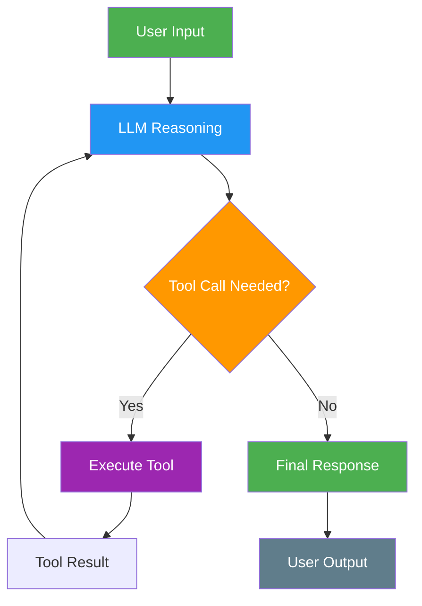

## 2. Prompt Chaining

### Description

**Prompt Chaining** decomposes a task into a fixed sequence of steps, where each LLM call processes the output of the previous one. Each step is a focused, well-defined subtask with its own prompt, and the output of one step feeds directly into the next.

### When to Use

- Tasks that can be cleanly decomposed into sequential subtasks
- When each step benefits from a specialized prompt
- Workflows where intermediate validation is needed (e.g., generate then verify)
- Data transformation pipelines (extract -> transform -> summarize)

### Benefits

| Benefit | Description |
|---|---|
| **Reliability** | Each step has a focused prompt, reducing errors |
| **Debuggability** | Easy to pinpoint which step failed |
| **Quality Control** | Each step's output can be validated before passing forward |
| **Modularity** | Steps can be independently tested and improved |

### Architecture Diagram

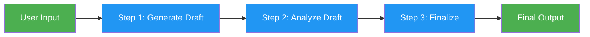

## 3. Routing

### Description

**Routing** classifies an incoming input and directs it to a specialized downstream handler. A router LLM (or rule-based classifier) examines the request and decides which specialized agent, prompt, or workflow should handle it. This enables separation of concerns and allows each branch to be optimized independently.

### When to Use

- Multi-domain applications (e.g., customer support with billing, technical, general queries)
- When different input types require fundamentally different handling
- Systems where specialized prompts outperform a single generic prompt
- Building modular systems where new capabilities can be added as new routes

### Benefits

| Benefit | Description |
|---|---|
| **Specialization** | Each route has a tailored prompt for its domain |
| **Scalability** | Add new routes without modifying existing ones |
| **Accuracy** | Focused handlers outperform generalist approaches |
| **Separation of Concerns** | Each branch is independently maintainable |

### Architecture Diagram

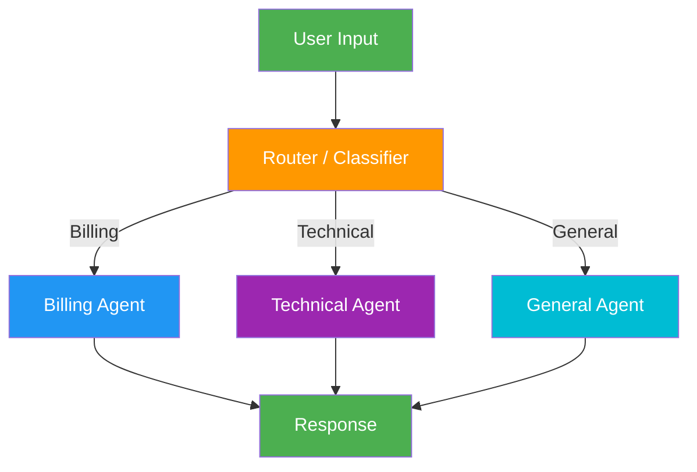

## 4. Parallelization

### Description

**Parallelization** fans out a task to multiple LLM calls that run concurrently, then aggregates their results. There are two main variants:
- **Sectioning:** Breaking a task into independent subtasks that run in parallel
- **Voting:** Running the same task multiple times to get diverse outputs for consensus

### When to Use

- Tasks with independent subtasks that don't depend on each other
- When you need multiple perspectives on the same problem (voting/ensemble)
- Reducing wall-clock time for multi-part analysis
- Quality assurance through redundant evaluation

### Benefits

| Benefit | Description |
|---|---|
| **Speed** | Concurrent execution reduces total time |
| **Quality** | Multiple perspectives catch more issues |
| **Robustness** | Voting reduces individual LLM errors |
| **Throughput** | Process more work in the same time window |

### Architecture Diagram

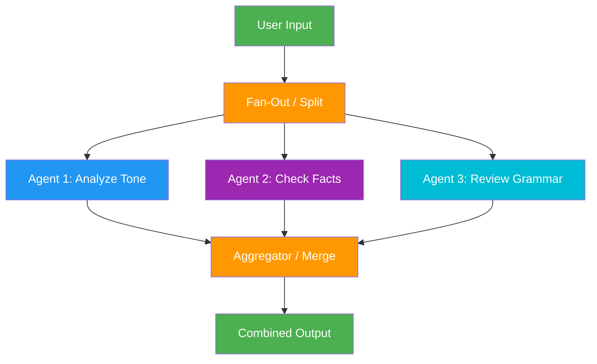

## 5. Orchestrator-Worker

### Description

In the **Orchestrator-Worker** pattern, a central orchestrator LLM dynamically breaks down a task into subtasks, delegates them to worker LLMs, and synthesizes their results. Unlike Parallelization (where subtasks are pre-defined), the orchestrator **dynamically determines** what subtasks are needed based on the specific input.

### When to Use

- Complex tasks where subtasks cannot be predicted in advance
- Coding tasks that require changes across multiple files
- Research tasks that need adaptive exploration strategies
- When the decomposition itself requires intelligence

### Benefits

| Benefit | Description |
|---|---|
| **Adaptability** | Subtask decomposition is dynamic, not hardcoded |
| **Scalability** | Can spawn as many workers as needed |
| **Intelligence** | Orchestrator applies reasoning to task breakdown |
| **Synthesis** | Final output integrates all worker contributions |

### Architecture Diagram

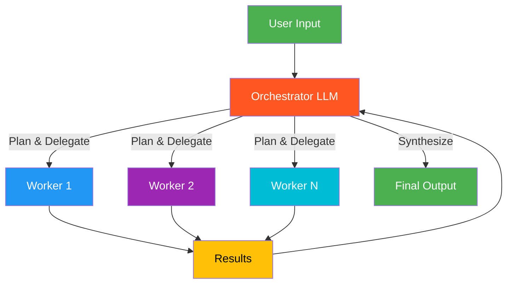

## 6. Supervisor (Hierarchical)

### Description

The **Supervisor** pattern places a central supervisor agent that controls all communication flow and task delegation among specialized worker agents. The supervisor decides which agent to invoke next based on the current context, receives the agent's output, and determines the next step. Unlike the Orchestrator-Worker pattern, the supervisor maintains an ongoing conversation and can re-invoke agents iteratively.

### When to Use

- When multiple specialized agents need coordinated, multi-turn interaction
- Tasks requiring iterative back-and-forth between different specialists
- When you need centralized control over agent execution order
- Complex workflows where the supervisor must reason about what to do next

### Benefits

| Benefit | Description |
|---|---|
| **Central Control** | Single point of coordination and decision-making |
| **Iterative** | Can loop back to agents based on intermediate results |
| **Specialization** | Each worker agent is an expert in its domain |
| **Observability** | All communication flows through the supervisor |

### Architecture Diagram

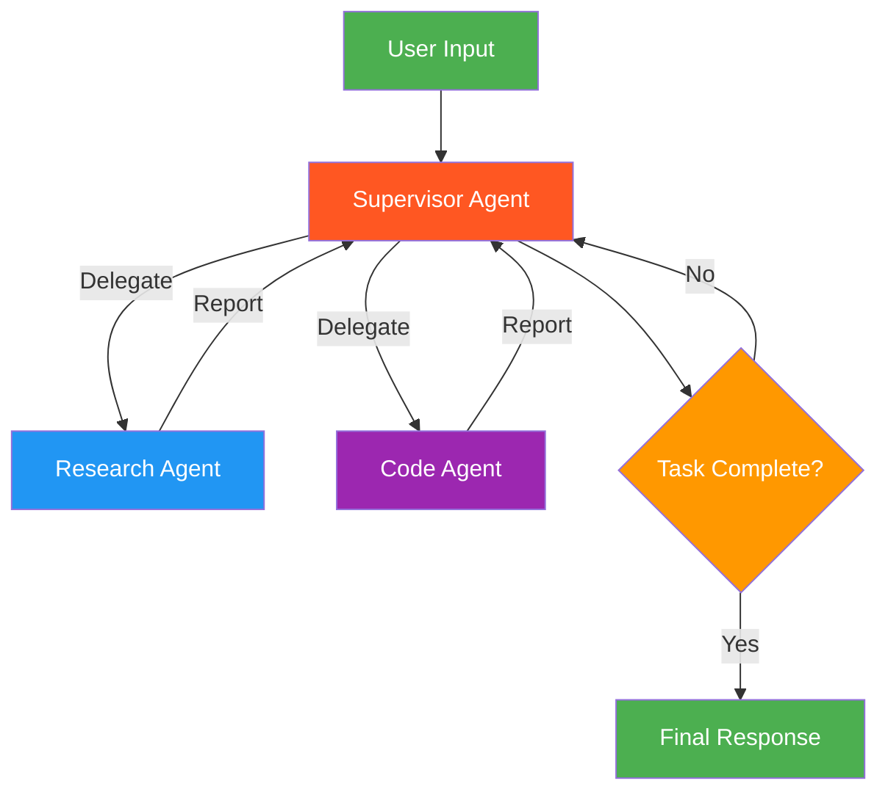

## 7. Reflection / Self-Correction

### Description

The **Reflection** pattern creates a feedback loop where an agent generates output, evaluates it against criteria, and iteratively refines it. The agent effectively becomes its own reviewer. This can be done by a single LLM with a self-critique prompt, or by two separate LLMs (a generator and a critic).

### When to Use

- Code generation (generate, test, fix errors)
- Long-form writing that benefits from iterative polishing
- Structured data extraction requiring validation
- Any task where LLM output can be demonstrably improved through feedback
- When you have clear, measurable quality criteria

### Benefits

| Benefit | Description |
|---|---|
| **Quality** | Iterative refinement produces better output than single-shot |
| **Self-Correction** | Catches and fixes its own errors |
| **Convergence** | Typically reaches passing quality in 2-3 iterations |
| **Autonomy** | No human feedback needed in the loop |

### Architecture Diagram

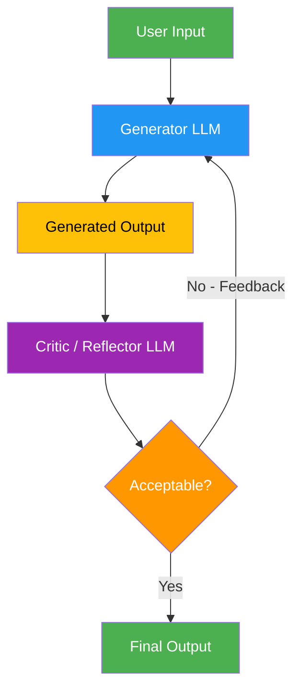

## 8. Evaluator-Optimizer

### Description

The **Evaluator-Optimizer** pattern separates generation and evaluation into two distinct LLM roles that operate in a loop. The **Generator** produces a response, and the **Evaluator** scores it against defined criteria and provides structured feedback. The loop continues until the evaluator's score exceeds a threshold or a maximum number of iterations is reached. This differs from Reflection in that the evaluator provides **structured scoring** rather than just textual feedback.

### When to Use

- When you have clear, quantifiable evaluation criteria (accuracy, completeness, format)
- Tasks where quality can be scored numerically
- Content that must meet specific standards before release
- When iterative refinement provides measurable, demonstrable value

### Benefits

| Benefit | Description |
|---|---|
| **Measurable Quality** | Numeric scoring tracks improvement objectively |
| **Structured Feedback** | Evaluator provides actionable, criteria-specific guidance |
| **Threshold Control** | Define minimum quality bars |
| **Separation of Concerns** | Generator and evaluator can use different prompts or models |

### Architecture Diagram

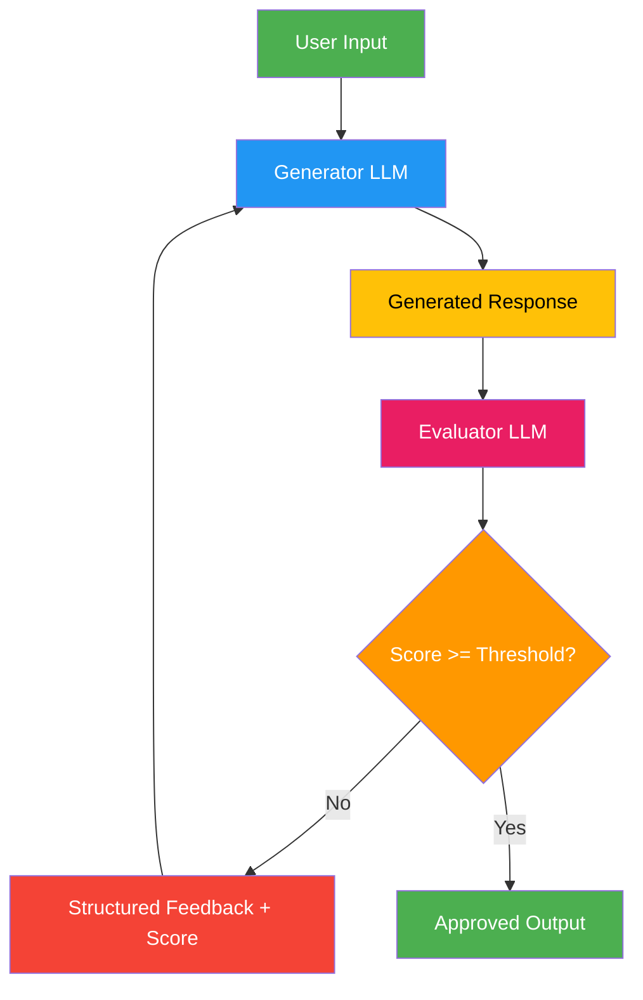

## 9. Swarm (Decentralized Handoff)

### Description

The **Swarm** pattern enables multiple peer agents to dynamically hand off control to one another based on their specializations. There is no central supervisor -- agents decide among themselves when to transfer a conversation. Each agent has **handoff tools** that allow it to pass context to another agent. The system tracks which agent is currently active.

### When to Use

- Conversational applications with multiple domains (e.g., customer service)
- When agents need fluid, natural transitions between specializations
- Peer-to-peer collaboration without hierarchical control
- When you want agents to self-organize based on the conversation flow

### Benefits

| Benefit | Description |
|---|---|
| **Decentralized** | No bottleneck at a central supervisor |
| **Natural Flow** | Agents hand off like human team members |
| **Flexible** | Agents decide when to transfer based on context |
| **Scalable** | Add new specialist agents without restructuring |

### Architecture Diagram

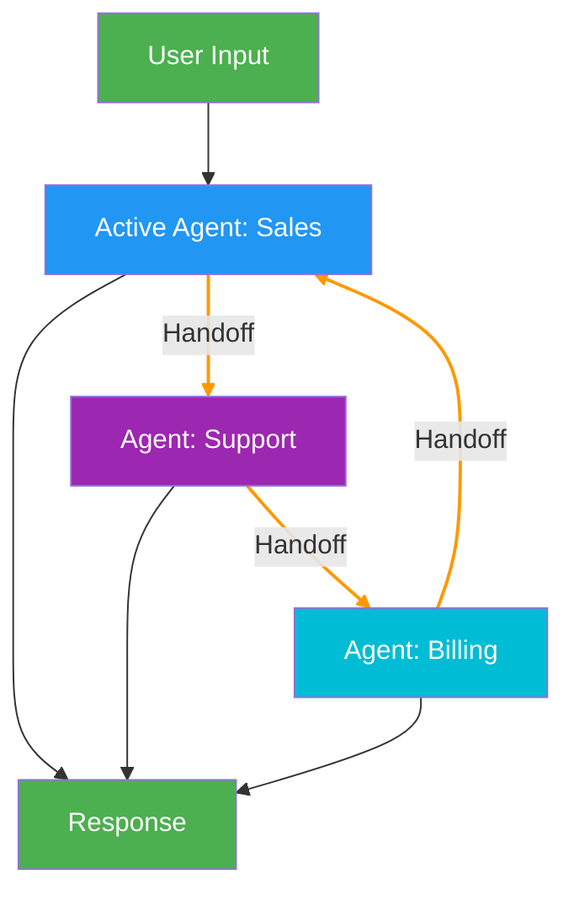

## 10. Hierarchical Multi-Agent Teams

### Description

**Hierarchical Multi-Agent Teams** extend the Supervisor pattern by nesting multiple supervisors into a tree structure. A top-level supervisor delegates to mid-level supervisors, each of which manages their own team of specialized worker agents. This mirrors how large organizations structure teams with managers and sub-teams.

### When to Use

- Large-scale, multi-domain tasks requiring many specialized agents
- When a single supervisor would be overloaded with too many workers
- Projects requiring both research AND implementation teams
- Enterprise workflows with clear team boundaries and responsibilities

### Benefits

| Benefit | Description |
|---|---|
| **Scalability** | Manage dozens of agents through hierarchical delegation |
| **Team Autonomy** | Each sub-team operates independently within its domain |
| **Reduced Complexity** | Each supervisor manages only a few direct reports |
| **Composability** | Teams can be assembled from reusable sub-team modules |

### Architecture Diagram

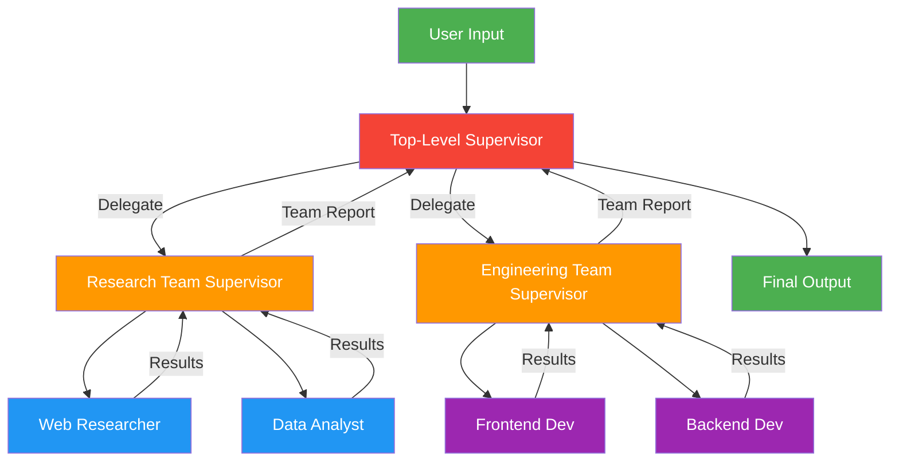

---

## Architecture Selection Guide

Use this decision framework to pick the right architecture for your use case:

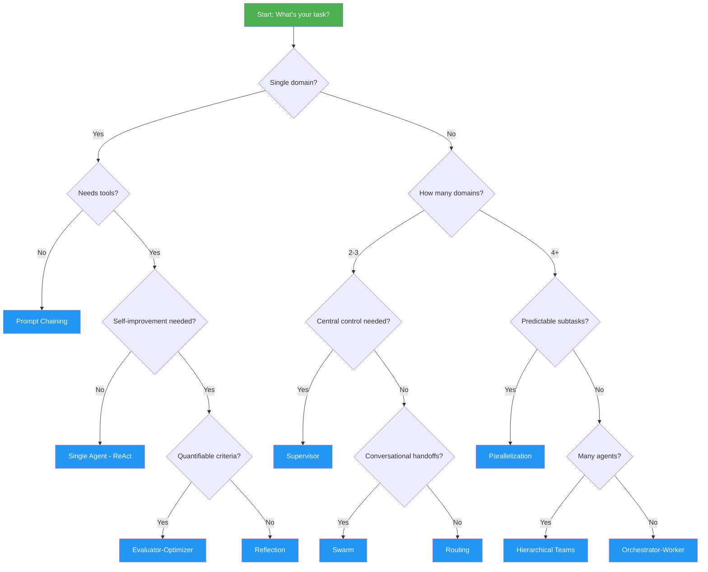

### Quick Reference Table

| Architecture | Complexity | Agents | Best For |
|---|---|---|---|
| **ReAct** | Low | 1 | Simple tool-augmented tasks |
| **Prompt Chaining** | Low | 1 | Sequential multi-step pipelines |
| **Routing** | Low-Medium | 1 + N handlers | Multi-domain classification |
| **Parallelization** | Medium | N parallel | Independent concurrent subtasks |
| **Orchestrator-Worker** | Medium-High | 1 + N dynamic | Complex tasks, unpredictable decomposition |
| **Supervisor** | Medium-High | 1 + N managed | Coordinated multi-agent with central control |
| **Reflection** | Medium | 1-2 | Self-improving output quality |
| **Evaluator-Optimizer** | Medium | 2 | Scored quality iteration |
| **Swarm** | High | N peer | Conversational multi-domain handoffs |
| **Hierarchical Teams** | High | N nested | Large-scale enterprise workflows |

---

## Key Principles

1. **Start simple.** Use a single ReAct agent first. Only add complexity when needed.
2. **Match architecture to task.** Don't use a multi-agent swarm when prompt chaining suffices.
3. **Minimize autonomy.** Give the system the smallest amount of freedom that still delivers the outcome.
4. **Combine patterns.** Real systems often layer multiple patterns (e.g., Supervisor + Reflection).
5. **Observe everything.** Log all agent decisions, tool calls, and handoffs for debugging.

---

## References

- [Anthropic: Building Effective Agents](https://www.anthropic.com/research/building-effective-agents)
- [LangGraph Documentation](https://docs.langchain.com/oss/python/langgraph/workflows-agents)
- [LangGraph Multi-Agent Workflows](https://blog.langchain.com/langgraph-multi-agent-workflows/)
- [LangGraph Supervisor (GitHub)](https://github.com/langchain-ai/langgraph-supervisor-py)
- [LangGraph Swarm (GitHub)](https://github.com/langchain-ai/langgraph-swarm-py)
- [Google Cloud: Agentic AI Design Patterns](https://docs.cloud.google.com/architecture/choose-design-pattern-agentic-ai-system)
- [Microsoft: Multi-Agent Reference Architecture](https://microsoft.github.io/multi-agent-reference-architecture/docs/reference-architecture/Reference-Architecture.html)
- [Anthropic Cookbook: Agent Patterns](https://github.com/anthropics/anthropic-cookbook/tree/main/patterns/agents)