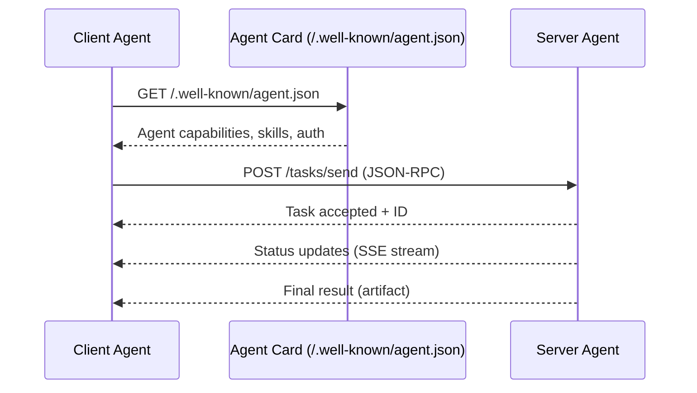

# 43. Agent-to-Agent Protocol (A2A)

!!! example "Mini-Project: A2A: Full Client + Server Round-Trip"
    A complete A2A implementation where a client discovers a server agent's capabilities via its Agent Card, submits tasks using JSON-RPC, and receives structured artifact results — all simulated in pure Python.

    [View on GitHub :material-github:](https://github.com/saisrinivas-samoju/agentic_architectures/blob/main/mini-projects/43-a2a-protocol.ipynb){ .md-button .md-button--primary }

---

## What It Is

The **Agent-to-Agent Protocol (A2A)** is an open protocol created by Google that enables AI agents built by different vendors to communicate and collaborate. While MCP connects models to tools, A2A focuses on **agent-to-agent communication** -- allowing agents to discover each other's capabilities, negotiate tasks, and exchange results. A2A defines Agent Cards (capability descriptions), task lifecycle management, and streaming updates.

## Who Created It / Governed By

Created by **Google** (April 2025). Open-source specification with broad industry support from over 50 companies including Salesforce, SAP, and Atlassian.

## How It Works

## Key Features

| Feature | Description |
|---|---|
| **Agent Cards** | JSON discovery documents at `/.well-known/agent.json` |
| **Task Model** | Structured task lifecycle (submitted, working, completed, failed) |
| **Streaming** | Server-Sent Events for real-time progress updates |
| **Multi-Turn** | Supports back-and-forth task refinement |
| **Artifacts** | Structured output objects (text, files, data) |
| **Push Notifications** | Server can notify client of async completions |
