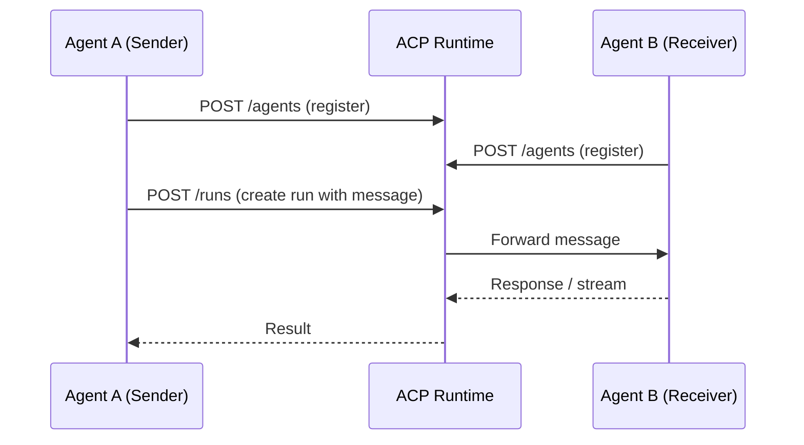

# 44. Agent Communication Protocol (ACP)

!!! example "Mini-Project: ACP: Two Different Agent Frameworks Interoperating"
    An ACP runtime that routes messages between a stateless function-based agent and a class-based stateful agent, demonstrating a multi-step clarification conversation across two different framework styles.

    [View on GitHub :material-github:](https://github.com/saisrinivas-samoju/agentic_architectures/blob/main/mini-projects/44-acp.ipynb){ .md-button .md-button--primary }

---

## What It Is

The **Agent Communication Protocol (ACP)** is an open protocol developed by IBM Research and BeeAI for enabling multi-agent communication. ACP uses a REST API model for server-to-server agent communication, supporting both synchronous and asynchronous patterns. Unlike A2A (focused on task delegation), ACP emphasizes **message-based communication** and is framework-agnostic (works with LangGraph, CrewAI, AutoGen, etc.).

## Who Created It / Governed By

Created by **IBM Research** and the **BeeAI** community (2025). Open-source specification focused on interoperability between diverse agent frameworks.

## How It Works

## Key Features

| Feature | Description |
|---|---|
| **REST-Based** | Standard HTTP REST API (OpenAPI spec) |
| **Agent Registration** | Agents register with metadata and capabilities |
| **Runs** | Task execution unit with lifecycle management |
| **Multimodal** | Supports text, files, and structured data |
| **Async Support** | Both sync and async communication patterns |
| **Framework Agnostic** | Works with any agent framework |
