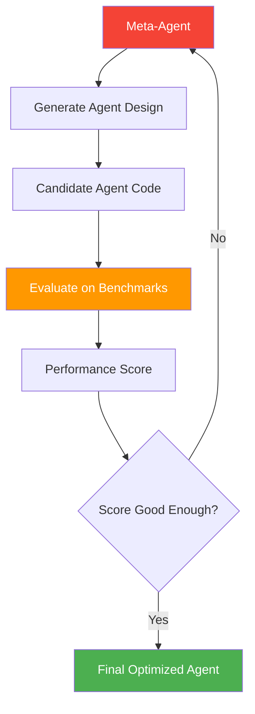

# 68. Automated Design of Agentic Systems (ADAS)

!!! example "Mini-Project: ADAS: Prompt Optimization via Automated Design Search"
    A meta-agent that proposes diverse system prompt candidates for a sentiment classifier, evaluates each on a labeled test suite using keyword heuristics, then mutates the best-performing prompt across iterations to automatically improve accuracy.

    [View on GitHub :material-github:](https://github.com/saisrinivas-samoju/agentic_architectures/blob/main/mini-projects/68-adas.ipynb){ .md-button .md-button--primary }

---

## Description

**ADAS** uses a meta-agent to automatically design, test, and optimize new agent architectures. Instead of humans manually designing agent workflows, ADAS searches the space of possible agent designs (prompts, tool combinations, graph topologies) and evaluates each candidate on benchmark tasks. The best-performing designs are refined through iterations.

## How It Works

A **meta-agent** generates candidate agent designs (as code), evaluates them against benchmarks, and iteratively improves the designs using the evaluation results as feedback. This is essentially an outer optimization loop around agent design.

## Architecture Diagram

