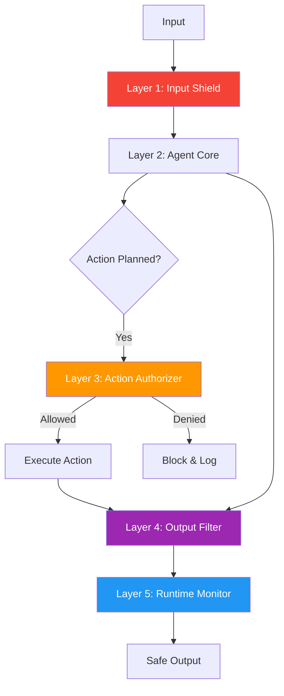

# 67. AEGIS Framework (Layered Safety Composition)

!!! example "Mini-Project: AEGIS Safety Framework"
    A multi-layer safety wrapper that applies input shielding, action authorization, output filtering, and runtime monitoring to block harmful inputs, prevent unauthorized actions, and redact credentials from agent responses.

    [View on GitHub :material-github:](https://github.com/saisrinivas-samoju/agentic_architectures/blob/main/mini-projects/67-aegis-framework.ipynb){ .md-button .md-button--primary }

---

## Description

Prevents a broad class of safety failures by implementing a comprehensive, layered defense strategy. AEGIS (Agent Environment Guard and Inspection System) combines input validation, output filtering, action authorization, and runtime monitoring into a unified safety framework.

AEGIS wraps an agent with multiple defense layers: (1) **Input Shield** validates and sanitizes inputs, (2) **Action Authorizer** checks if planned actions are allowed, (3) **Output Filter** screens responses, and (4) **Runtime Monitor** tracks anomalous behavior patterns.

## Architecture Diagram

