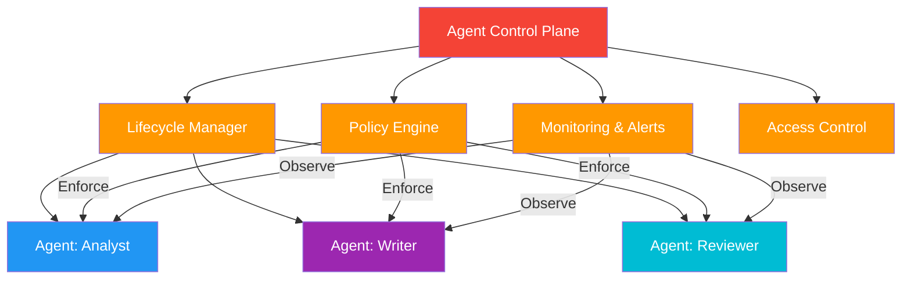

# 61. Agent Control Plane

!!! example "Mini-Project: Agent Control Plane Implementation"
    A centralized control plane that deploys agents with configurable policies, enforces rate limits, tracks per-agent metrics, and provides a unified dashboard for monitoring all agents in production.

    [View on GitHub :material-github:](https://github.com/saisrinivas-samoju/agentic_architectures/blob/main/mini-projects/61-agent-control-plane.ipynb){ .md-button .md-button--primary }

---

## Description

The **Agent Control Plane** is a centralized management layer that governs the lifecycle, policies, and operations of all agents in a system. It handles agent deployment, versioning, scaling, access control, rate limiting, monitoring, and policy enforcement. Think of it as the Kubernetes control plane, but for AI agents.

The control plane separates **what agents do** (their capabilities) from **how they are managed** (lifecycle, policies, observability), allowing platform teams to govern agents without modifying their logic.

## When to Use

- Enterprise deployments with many agents requiring governance
- When you need centralized policy enforcement (rate limits, access control)
- Multi-team environments needing agent lifecycle management
- Production systems requiring monitoring, alerting, and scaling

## Benefits

| Benefit | Description |
|---|---|
| **Governance** | Centralized policy enforcement across all agents |
| **Lifecycle Management** | Deploy, version, scale, and retire agents |
| **Observability** | Unified monitoring, logging, and alerting |
| **Security** | Centralized access control and audit trails |

## Architecture Diagram

