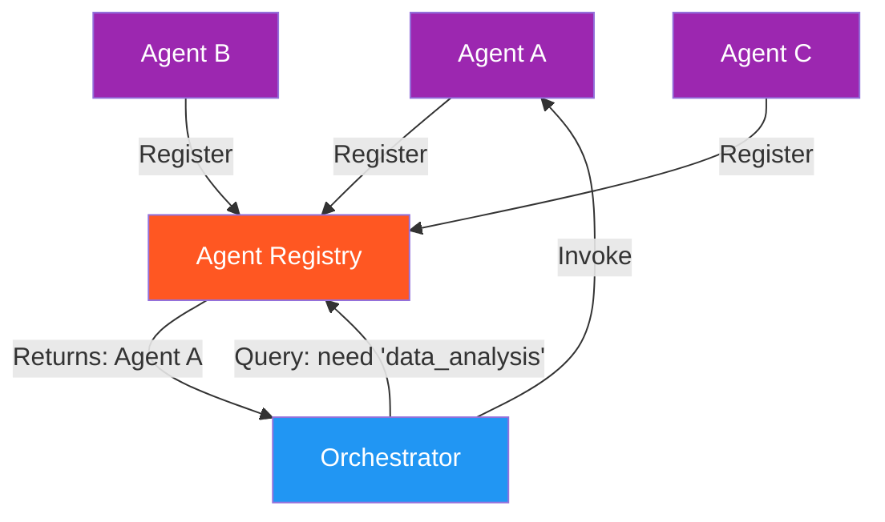

# 60. Agent Registry and Discovery

!!! example "Mini-Project: Agent Registry and Discovery System"
    A centralized agent registry where agents register their capabilities, versions, and endpoints, enabling orchestrators to discover the best available agent for any capability at runtime.

    [View on GitHub :material-github:](https://github.com/saisrinivas-samoju/agentic_architectures/blob/main/mini-projects/60-agent-registry-discovery.ipynb){ .md-button .md-button--primary }

---

## Description

**Agent Registry and Discovery** provides a centralized (or distributed) catalog where agents register their capabilities, APIs, and metadata. Other agents or orchestrators query the registry to discover which agents can handle specific tasks. This is the agent equivalent of a service registry (like Consul, Eureka, or DNS-SD) and is essential for large-scale multi-agent deployments where agents are independently developed and deployed.

## When to Use

- Large organizations with many independently developed agents
- When agents need to dynamically discover collaborators
- Multi-tenant environments where different teams publish agents
- Systems that need capability-based routing (not hardcoded)

## Benefits

| Benefit | Description |
|---|---|
| **Dynamic Discovery** | Agents find collaborators at runtime |
| **Decoupled Development** | Teams build agents independently |
| **Versioning** | Multiple versions of agents can coexist |
| **Health Tracking** | Registry monitors agent health and availability |

## Architecture Diagram

