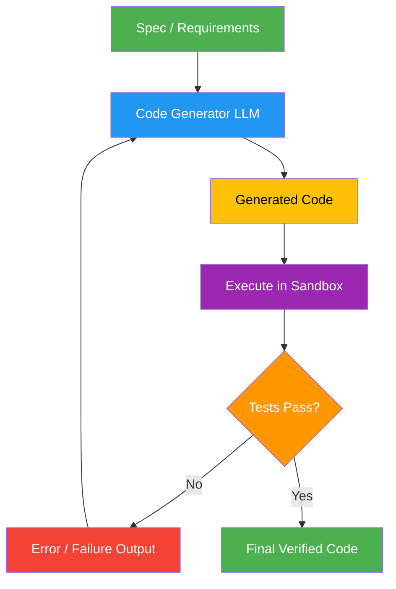

# 32. Agentic Coding

!!! example "Mini-Project: Self-Healing Code Generator"
    An agentic coding system that writes Python code from a specification, executes it in a sandbox, and automatically repairs bugs using error feedback until all tests pass.

    [View on GitHub :material-github:](https://github.com/saisrinivas-samoju/agentic_architectures/blob/main/mini-projects/32-agentic-coding.ipynb){ .md-button .md-button--primary }

---

## Description

**Agentic Coding** uses LLM agents to autonomously write, test, debug, and refine code. The agent operates in a cycle: it writes code based on a specification, executes it in a sandbox, observes errors or test failures, and iterates until the code passes all tests. This goes beyond simple code generation by including **execution feedback** and **self-repair** capabilities.

Tools like Claude Code, Cursor, Devin, and GitHub Copilot Workspace use this pattern. The key insight is that code is uniquely suitable for agentic iteration because correctness can be verified automatically through tests and execution.

## When to Use

- Generating code that must actually run correctly (not just look right)
- Automated bug fixing with test-driven repair
- Multi-file code generation with integration testing
- Code migration or refactoring tasks

## Benefits

| Benefit | Description |
|---|---|
| **Verified Output** | Code is tested, not just generated |
| **Self-Repair** | Agent fixes its own bugs using error messages |
| **Iteration** | Multiple attempts converge on correct solutions |
| **Practical** | Produces runnable code, not just suggestions |

## Architecture Diagram

