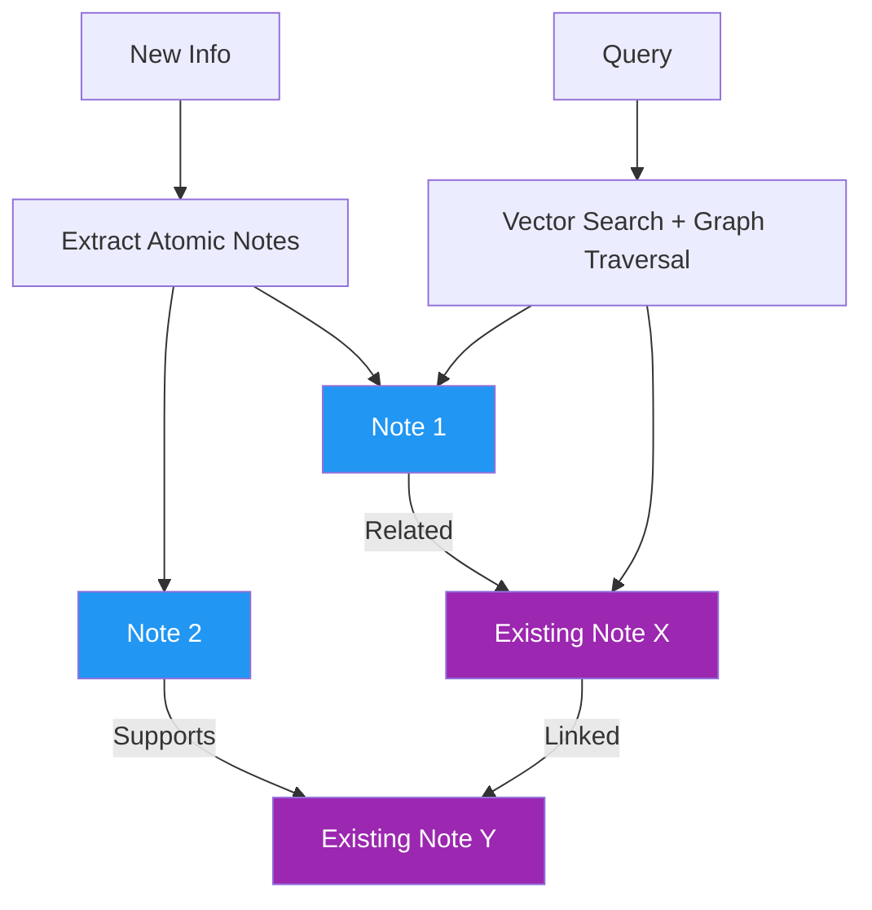

# 49. Agentic Memory (A-MEM / Zettelkasten-style)

!!! example "Mini-Project: Zettelkasten-style Agentic Memory"
    A Zettelkasten-inspired memory system where atomic notes are linked to related notes, supporting both tag-based lookup and graph traversal — enabling an agent to discover non-obvious cross-domain connections when answering questions.

    [View on GitHub :material-github:](https://github.com/saisrinivas-samoju/agentic_architectures/blob/main/mini-projects/49-agentic-memory.ipynb){ .md-button .md-button--primary }

---

## What It Is

**Agentic Memory (A-MEM)** applies the Zettelkasten note-taking methodology to agent memory. Each memory is an atomic "note" with rich metadata (tags, links to related notes). Notes are densely interconnected, forming a knowledge graph where ideas link to related ideas. The agent traverses these links to discover non-obvious connections -- creating a "second brain" that grows organically.

## What It Stores (Examples)

- Atomic insights extracted from conversations
- Linked notes connecting related concepts across domains
- Source attributions and confidence levels
- Progressive refinement as notes are updated

## How It's Implemented

Uses a **graph structure** where each node is a note (with embedding for semantic search) and edges represent explicit links.

## Mermaid Diagram

