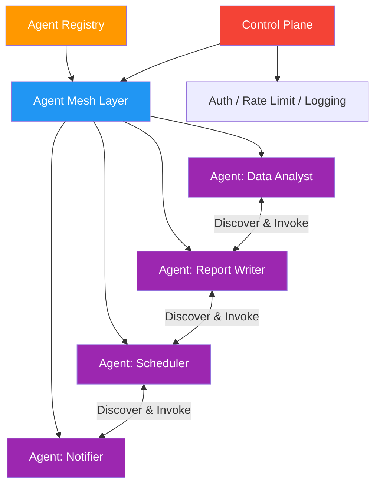

# 59. Agentic Mesh

!!! example "Mini-Project: Simulated Agentic Mesh with Service Discovery"
    A distributed agent mesh where agents register their capabilities in a shared registry and an orchestrator discovers and invokes them dynamically, with retry logic and latency tracking built into the mesh layer.

    [View on GitHub :material-github:](https://github.com/saisrinivas-samoju/agentic_architectures/blob/main/mini-projects/59-agentic-mesh.ipynb){ .md-button .md-button--primary }

---

## Description

An **Agentic Mesh** is a distributed infrastructure pattern where autonomous agents are deployed as independent services that discover and communicate with each other over a network. Unlike centralized orchestration, each agent registers itself with a service mesh, advertises its capabilities, and can be invoked by any other agent. This is the agent equivalent of a microservices mesh (like Istio or Linkerd), with added features for capability-based routing and agent discovery.

The agentic mesh provides cross-cutting concerns: authentication, rate limiting, observability, and load balancing -- freeing individual agents from infrastructure concerns.

## When to Use

- Enterprise-scale multi-agent systems with many independent teams building agents
- When agents need to discover and invoke each other dynamically
- Cross-organizational agent collaboration
- Production deployments requiring service mesh features (auth, observability, rate limiting)

## Benefits

| Benefit | Description |
|---|---|
| **Decentralized** | No single point of failure or bottleneck |
| **Discovery** | Agents find each other by capability, not hardcoded addresses |
| **Resilience** | Mesh handles retries, circuit breaking, and failover |
| **Governance** | Centralized policy enforcement across all agents |

## Architecture Diagram

