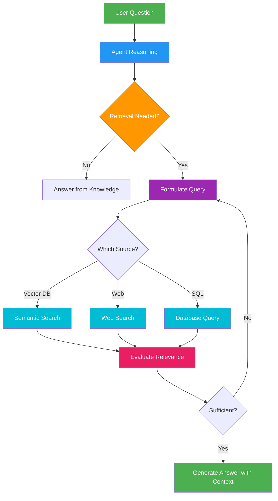

# 31. Agentic RAG

!!! example "Mini-Project: Technical Documentation Assistant"
    An agentic RAG system that intelligently routes queries across vector search, keyword search, and web search sources, reformulating queries and retrying when results are insufficient.

    [View on GitHub :material-github:](https://github.com/saisrinivas-samoju/agentic_architectures/blob/main/mini-projects/31-agentic-rag.ipynb){ .md-button .md-button--primary }

---

## Description

**Agentic RAG** (Retrieval-Augmented Generation) goes beyond simple retrieve-then-generate by giving the agent the ability to **decide when, what, and how to retrieve**. Instead of always retrieving before answering, the agent reasons about whether retrieval is needed, formulates targeted queries, evaluates retrieved documents for relevance, and may perform multiple retrieval rounds. The agent can also choose between different retrieval sources (vector DB, web search, SQL database).

## When to Use

- Question-answering over large document collections
- When queries require multi-step retrieval (initial search, then follow-up)
- Systems with multiple knowledge sources that need intelligent routing
- When retrieved documents need relevance filtering before use

## Benefits

| Benefit | Description |
|---|---|
| **Precision** | Agent crafts targeted queries instead of naive retrieval |
| **Multi-Source** | Can query different stores based on the question type |
| **Self-Correcting** | Detects poor retrievals and retries with refined queries |
| **Efficiency** | Skips retrieval when the LLM already knows the answer |

## Architecture Diagram

