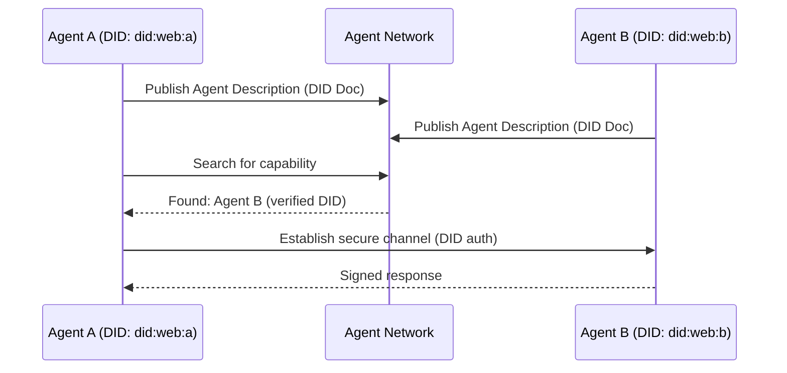

# 45. Agent Network Protocol (ANP)

!!! example "Mini-Project: ANP: Decentralized Identity + Mutual Trust Verification"
    Two agents with independent DIDs exchange DID documents, mutually verify each other via HMAC-based signing (no central authority), then communicate with cryptographically signed messages — demonstrating tamper detection for invalid signatures.

    [View on GitHub :material-github:](https://github.com/saisrinivas-samoju/agentic_architectures/blob/main/mini-projects/45-anp.ipynb){ .md-button .md-button--primary }

---

## What It Is

The **Agent Network Protocol (ANP)** is an open protocol designed for large-scale, open agent networks where agents from different organizations discover and interact over the internet. ANP uses **Decentralized Identifiers (DIDs)** for agent identity and **Verifiable Credentials (VCs)** for trust establishment, making it suitable for open, trustless environments where billions of agents need to find, trust, and collaborate with each other.

## Who Created It / Governed By

Created by the **ANP Community** (2025). Open-source specification building on W3C standards for DIDs and VCs. Focused on decentralized, internet-scale agent networking.

## How It Works

## Key Features

| Feature | Description |
|---|---|
| **Decentralized Identity** | DIDs (W3C standard) for agent identification |
| **Verifiable Credentials** | Trust establishment without central authority |
| **Agent Description** | Rich capability descriptions linked to DIDs |
| **Meta-Protocol** | Agents negotiate communication protocols dynamically |
| **Internet-Scale** | Designed for billions of agents across organizations |
| **Privacy** | Selective disclosure of agent capabilities |

## Protocol Comparison

| Feature | MCP | A2A | ACP | ANP |
|---|---|---|---|---|
| **Created By** | Anthropic | Google | IBM / BeeAI | ANP Community |
| **Focus** | Model-to-tool | Agent-to-agent | Agent communication | Internet-scale networking |
| **Discovery** | Server capabilities | Agent Cards | Agent registry | DID-based |
| **Transport** | stdio, HTTP+SSE | HTTP, SSE | REST API | HTTP, DID resolution |
| **Identity** | N/A (local) | Agent Cards | Registration | DIDs + VCs |
| **Scale** | Local/organization | Organization | Organization | Internet-scale |
| **Best For** | Tool integration | Cross-vendor agent collab | Framework interop | Open agent networks |
| **Maturity** | Production (2024) | Early adoption (2025) | Early (2025) | Specification (2025) |
