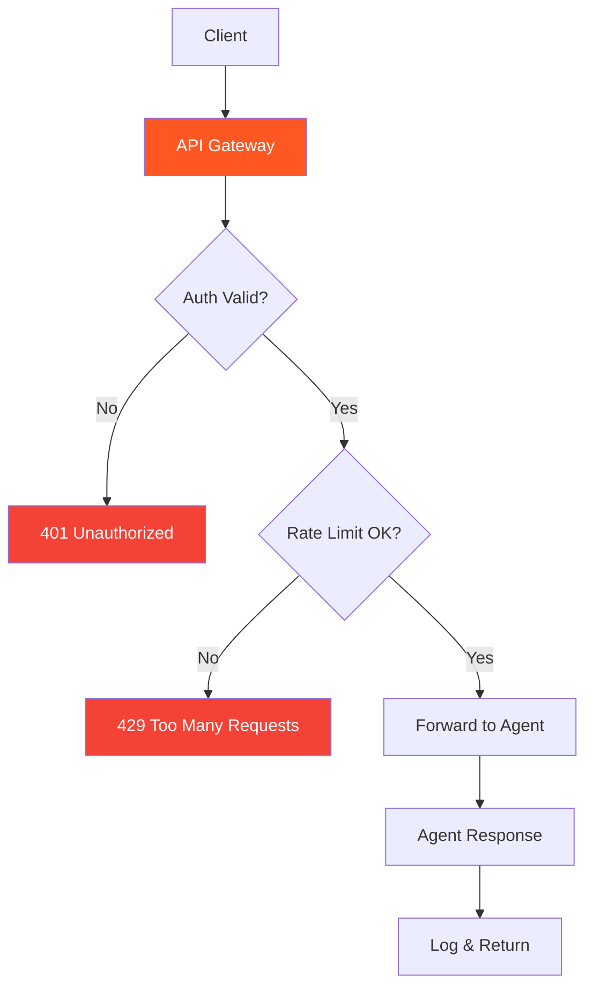

# 56. API Gateway / Gatekeeper Pattern

!!! example "Mini-Project: API Gateway for Agent Access Control"
    A centralized gateway that enforces authentication, rate limiting, and request schema validation before forwarding requests to the target agent, logging all activity.

    [View on GitHub :material-github:](https://github.com/saisrinivas-samoju/agentic_architectures/blob/main/mini-projects/56-api-gateway-gatekeeper.ipynb){ .md-button .md-button--primary }

---

## Description

Prevents unauthorized access, rate abuse, and unmonitored agent activity. Centralizes authentication, rate limiting, and request logging for all agent interactions.

All agent requests pass through a centralized gateway that enforces authentication, rate limits, request validation, and logging before forwarding to the target agent.

## Architecture Diagram

