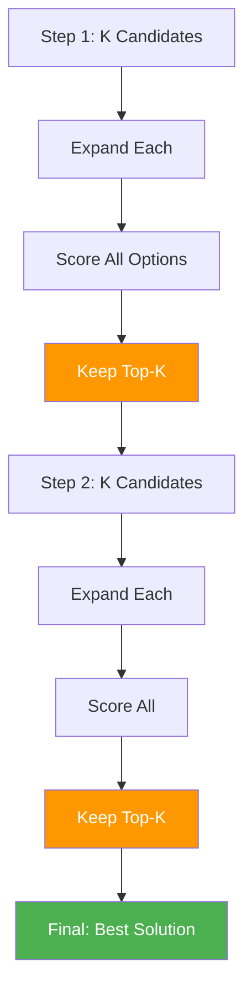

# 41. Beam Search for Agents

!!! example "Mini-Project: Beam Search for Agent Solution Generation"
    A beam search agent that maintains the top-K most promising partial solutions at each step, expanding and scoring all candidates before pruning, then compares the result against a greedy baseline.

    [View on GitHub :material-github:](https://github.com/saisrinivas-samoju/agentic_architectures/blob/main/mini-projects/41-beam-search-agents.ipynb){ .md-button .md-button--primary }

---

## Description

**Beam Search for Agents** maintains the top-K most promising partial solutions at each step (the "beam"), rather than exploring all possibilities or committing to a single path. At each step, all beams are expanded with possible next actions, scored, and only the top-K survive. This balances between exhaustive search (too expensive) and greedy search (too myopic).

## How It Works

1. Start with K initial candidates
2. For each candidate, generate possible next steps
3. Score all candidates (existing + new steps)
4. Keep only the top-K
5. Repeat until solutions are complete

## Diagram

