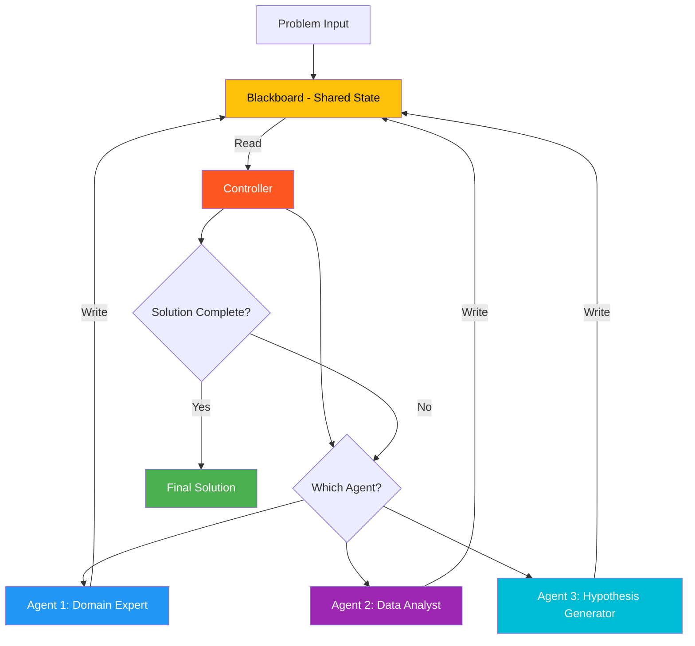

# 19. Blackboard Pattern

!!! example "Mini-Project: Medical Diagnosis Blackboard System"
    Specialist agents (symptom analyst, lab interpreter, diagnosis generator) take turns reading and writing to a shared blackboard, with a controller deciding who contributes next until a final diagnosis emerges.

    [View on GitHub :material-github:](https://github.com/saisrinivas-samoju/agentic_architectures/blob/main/mini-projects/19-blackboard-pattern.ipynb){ .md-button .md-button--primary }

---

## Description

The **Blackboard Pattern** is a classic AI architecture where multiple specialist agents share a common data structure (the "blackboard"). Each agent monitors the blackboard, contributes when it can, and reads contributions from others. A **controller** decides which agent should contribute next based on the current state of the blackboard. Unlike message-passing architectures, agents communicate indirectly through shared state.

This pattern originated in speech recognition systems (the Hearsay-II system, 1970s) and is well-suited for problems where the solution emerges incrementally from the contributions of multiple knowledge sources.

## When to Use

- Problems requiring integration of diverse knowledge sources
- When the solution must be built incrementally from partial contributions
- Diagnostic or classification tasks with multiple evidence streams
- When agents need to see each other's contributions to make progress

## Benefits

| Benefit | Description |
|---|---|
| **Shared Context** | All agents see the same evolving state |
| **Incremental Solution** | Solution builds up piece by piece |
| **Loose Coupling** | Agents don't need to know about each other |
| **Opportunistic** | Any agent can contribute when it has relevant knowledge |

## Architecture Diagram

