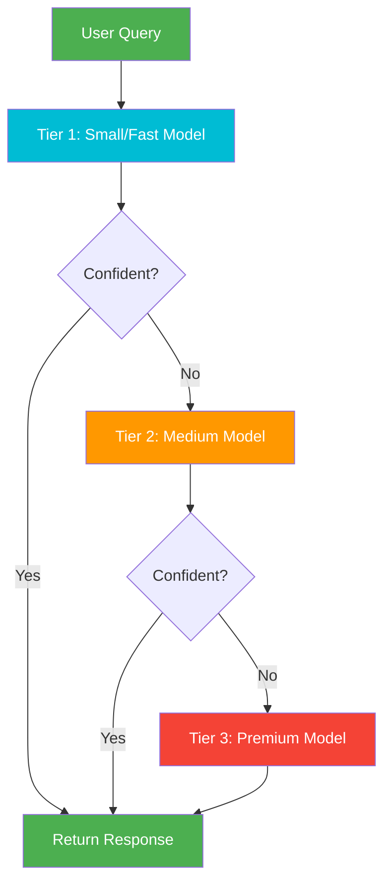

# 18. Cascading Agents (Model Cascading)

!!! example "Mini-Project: Cost-Optimized Model Cascade"
    Routes queries through a fast cheap model first — if confidence is high, returns immediately; otherwise escalates to a premium model, optimizing cost while maintaining quality on hard queries.

    [View on GitHub :material-github:](https://github.com/saisrinivas-samoju/agentic_architectures/blob/main/mini-projects/18-cost-optimized-model-cascade.ipynb){ .md-button .md-button--primary }

---

## Description

**Cascading Agents** route tasks through a hierarchy of models ordered by capability and cost. A small, fast, cheap model handles the request first. If the model's confidence is below a threshold (or the task is flagged as complex), it escalates to a larger, more capable (and expensive) model. This optimizes the cost-quality tradeoff: easy queries are handled cheaply, and only difficult queries incur the cost of a premium model.

This pattern is used extensively in production systems (e.g., Gemini Flash → Gemini Pro) and is also known as **model cascading** or **tiered inference**.

## When to Use

- High-volume applications where most queries are simple
- When cost optimization is critical
- Systems requiring different quality tiers
- When you can reliably estimate task difficulty

## Benefits

| Benefit | Description |
|---|---|
| **Cost Efficiency** | 80%+ of queries handled by cheap models |
| **Quality Preservation** | Hard queries still get premium model treatment |
| **Latency Reduction** | Simple queries get faster responses |
| **Scalability** | Lower compute costs enable higher throughput |

## Architecture Diagram

