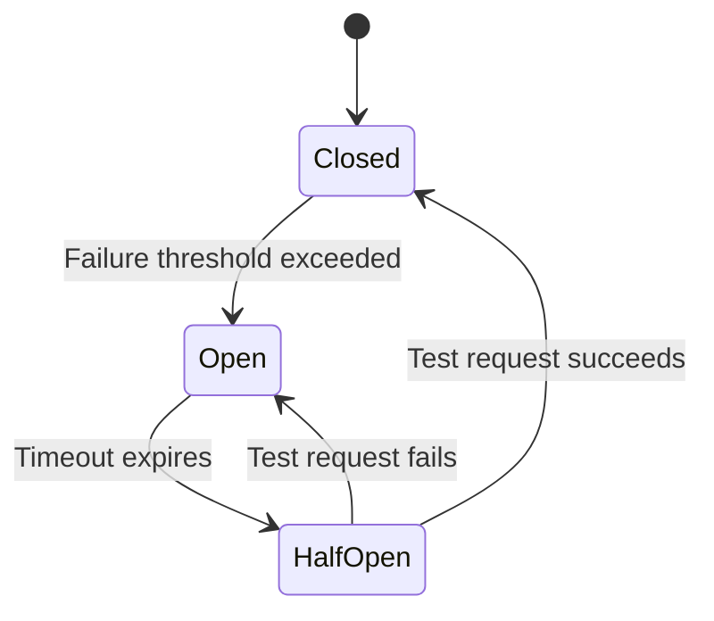

# 54. Circuit Breaker Pattern

!!! example "Mini-Project: Circuit Breaker for Agent Tool Calls"
    A circuit breaker wrapper around agent tool calls that transitions between Closed, Open, and Half-Open states to prevent cascading failures when external services become unavailable.

    [View on GitHub :material-github:](https://github.com/saisrinivas-samoju/agentic_architectures/blob/main/mini-projects/54-circuit-breaker.ipynb){ .md-button .md-button--primary }

---

## Description

Prevents cascading failures when an external service (API, database, LLM provider) becomes unavailable or degraded. Without a circuit breaker, an agent will keep retrying failed calls, wasting resources and potentially causing system-wide failures.

The circuit breaker monitors failure rates for external calls. It has three states: **Closed** (normal operation), **Open** (all calls fail fast without trying), and **Half-Open** (allows a test request to check if the service recovered). After a threshold of failures, the circuit "opens" and all subsequent calls return a fallback response immediately.

## Architecture Diagram

