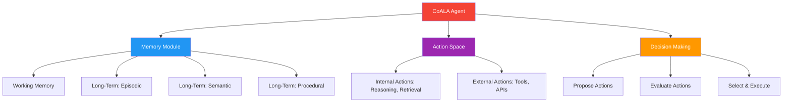

# 66. CoALA (Cognitive Architectures for Language Agents)

!!! example "Mini-Project: CoALA Taxonomy: Comparing Architectures via CoALA Framework"
    A structured comparison of three agent architectures (ReAct, Plan-and-Execute, Memory-Augmented) across the CoALA dimensions of memory, action space, and decision-making strategy, printed as a formatted comparison table.

    [View on GitHub :material-github:](https://github.com/saisrinivas-samoju/agentic_architectures/blob/main/mini-projects/66-coala.ipynb){ .md-button .md-button--primary }

---

## Description

**CoALA** is a conceptual framework (Sumers et al., 2023) that provides a unified way to describe and compare language agent architectures. It models every language agent as having three core components: (1) **memory** (working memory, long-term episodic/semantic/procedural), (2) **action space** (internal reasoning actions + external tool/environment actions), and (3) **decision-making** (the process that selects actions based on memory state). CoALA gives us a common vocabulary to analyze and design agents.

CoALA is not itself an implementation but a **taxonomy**. It provides the lens through which we can classify ReAct agents (simple memory + tool actions), Plan-and-Execute agents (richer decision-making), and memory-augmented agents. It unifies all patterns in this guide under a common conceptual framework.

## When to Use

- When designing a new agent architecture from scratch
- As an analysis framework for comparing existing agent designs
- When teaching or documenting agent system design
- Architecture reviews and design documents

## Core Components

