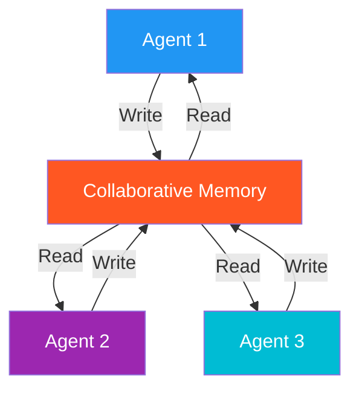

# 50. Collaborative Memory

!!! example "Mini-Project: Collaborative Memory for Multi-Agent Team"
    A three-agent team (researcher, analyst, writer) that collaborates through a thread-safe shared memory pool — each agent writes its findings so all downstream agents can build on them, producing a unified final report.

    [View on GitHub :material-github:](https://github.com/saisrinivas-samoju/agentic_architectures/blob/main/mini-projects/50-collaborative-memory.ipynb){ .md-button .md-button--primary }

---

## What It Is

**Collaborative Memory** is a shared memory pool accessible to multiple agents. When one agent learns something, it writes to shared memory, making that knowledge available to all. This prevents redundant learning and enables agents to build on each other's discoveries -- like a shared wiki for an agent team.

## What It Stores (Examples)

- Shared task context across agents in a pipeline
- Discovered facts multiple agents might need
- Intermediate results from one agent useful to others
- Accumulated decisions and rationale

## How It's Implemented

Uses a **shared key-value store or in-memory state** that all agents read from and write to.

## Mermaid Diagram

