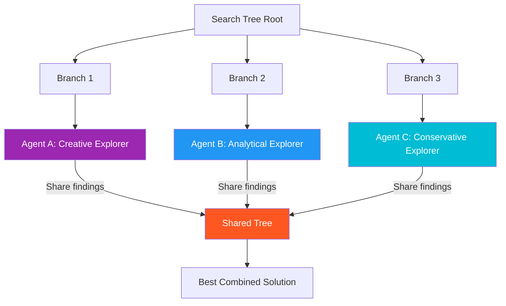

# 40. Collaborative Tree Search (CoTS)

!!! example "Mini-Project: Collaborative Tree Search"
    A multi-agent tree search where specialized agents explore different branches in parallel, cross-examine each other's scores, then all collaborate on a deep-dive of the winning branch before synthesizing a final solution.

    [View on GitHub :material-github:](https://github.com/saisrinivas-samoju/agentic_architectures/blob/main/mini-projects/40-collaborative-tree-search.ipynb){ .md-button .md-button--primary }

---

## Description

**Collaborative Tree Search (CoTS)** uses multiple agents to explore different branches of a search tree simultaneously. Each agent specializes in a different type of reasoning (e.g., one explores creative solutions, another explores conservative ones). Agents share discoveries through a shared tree structure, enabling faster and more diverse exploration.

## How It Works

Multiple agents explore different branches of the same search tree in parallel, sharing their findings through a common tree data structure.

## Diagram

