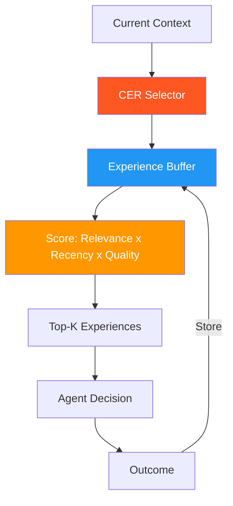

# 51. Contextual Experience Replay (CER)

!!! example "Mini-Project: Contextual Experience Replay"
    An agent loop that executes tasks, records experiences in a priority buffer, and replays the most relevant past experiences as in-context examples to improve future decisions.

    [View on GitHub :material-github:](https://github.com/saisrinivas-samoju/agentic_architectures/blob/main/mini-projects/51-contextual-experience-replay.ipynb){ .md-button .md-button--primary }

---

## Description

**Contextual Experience Replay (CER)** selectively replays past experiences that are contextually relevant to the current task. Unlike episodic memory (retrieval by similarity), CER prioritizes experiences based on utility -- considering recency, relevance, outcome quality, and task similarity. Inspired by experience replay in reinforcement learning (DQN), adapted for language agents.

## What It Stores

- Task-outcome pairs with context features
- Priority scores based on outcome quality
- Failure cases for error avoidance
- Recency-weighted experiences

## How It's Implemented

Uses a **priority queue** with weighted sampling from an experience buffer.

## Architecture Diagram

