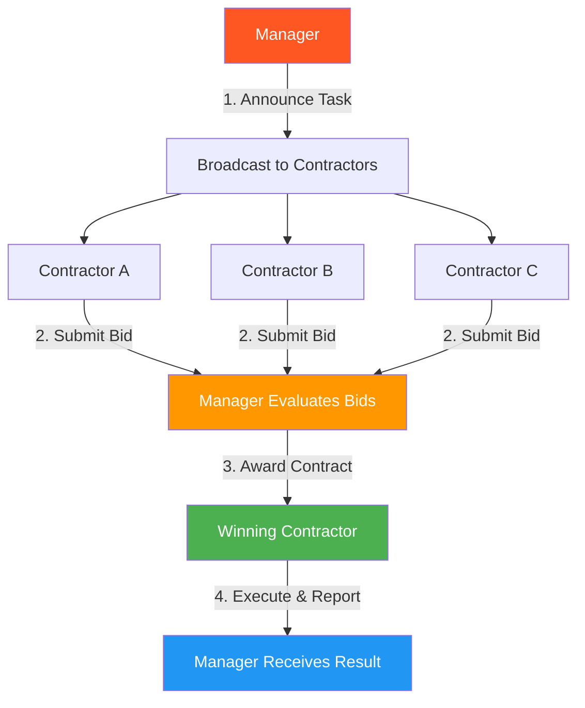

# 21. Contract Net Protocol (CNP)

!!! example "Mini-Project: Contract Net Protocol for Document Processing"
    A manager announces a document processing task, specialist contractors (legal, financial, general) submit formal bids with suitability and quality scores, the manager awards the contract, and the winner delivers results.

    [View on GitHub :material-github:](https://github.com/saisrinivas-samoju/agentic_architectures/blob/main/mini-projects/21-contract-net-protocol.ipynb){ .md-button .md-button--primary }

---

## Description

The **Contract Net Protocol (CNP)** is a formalization of the bidding pattern from multi-agent systems research (Smith, 1980). A **manager** agent announces a task, **contractor** agents evaluate and bid on it, the manager awards the contract to the best bidder, and the contractor reports results back. Unlike simple bidding, CNP includes formal stages: announcement, bidding, awarding, and reporting, with the possibility of subcontracting.

CNP is a FIPA (Foundation for Intelligent Physical Agents) standard protocol, widely used in manufacturing, logistics, and supply chain agent systems.

## When to Use

- Formal task delegation in enterprise agent systems
- When you need auditable task assignment with clear contracts
- Supply chain and logistics coordination
- When subcontracting (multi-level delegation) is needed

## Benefits

| Benefit | Description |
|---|---|
| **Formal Protocol** | Well-defined stages with clear semantics |
| **Accountability** | Each task has a clear owner and contract |
| **Subcontracting** | Winners can further delegate subtasks |
| **Standards-Based** | Follows FIPA standards for interoperability |

## Architecture Diagram

