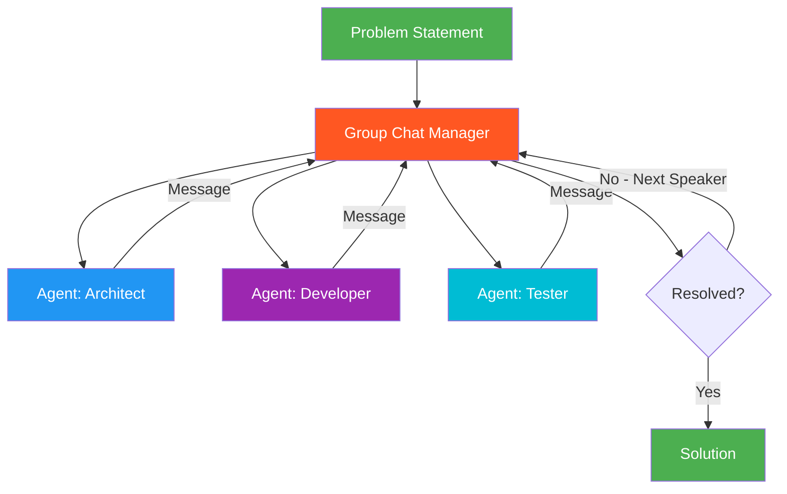

# 25. Conversational Multi-Agent (AutoGen-style)

!!! example "Mini-Project: Conversational Multi-Agent Problem Solving"
    An architect, developer, and tester agent hold a group chat moderated by an LLM speaker selector, debating and building on each other's ideas to design a high-scale real-time notification system.

    [View on GitHub :material-github:](https://github.com/saisrinivas-samoju/agentic_architectures/blob/main/mini-projects/25-conversational-multi-agent.ipynb){ .md-button .md-button--primary }

---

## Description

**Conversational Multi-Agent** creates a group chat where multiple agents converse with each other in natural language to solve a problem. Each agent has a distinct role and can respond to other agents' messages. A group chat manager determines speaking order — it can be round-robin, random, or LLM-selected. This pattern, popularized by Microsoft's AutoGen framework, enables emergent problem-solving through natural conversation.

The key insight is that agents build on each other's contributions conversationally, mimicking how human teams brainstorm and solve problems through discussion.

## When to Use

- Brainstorming and creative problem-solving
- Code review and collaborative development
- Multi-perspective analysis
- When natural conversation flow is preferred over rigid workflows

## Benefits

| Benefit | Description |
|---|---|
| **Natural Interaction** | Agents converse like human teammates |
| **Emergent Solutions** | Ideas build organically through dialogue |
| **Flexible** | No predefined workflow — conversation flows naturally |
| **Transparent** | Full conversation log shows reasoning process |

## Architecture Diagram

