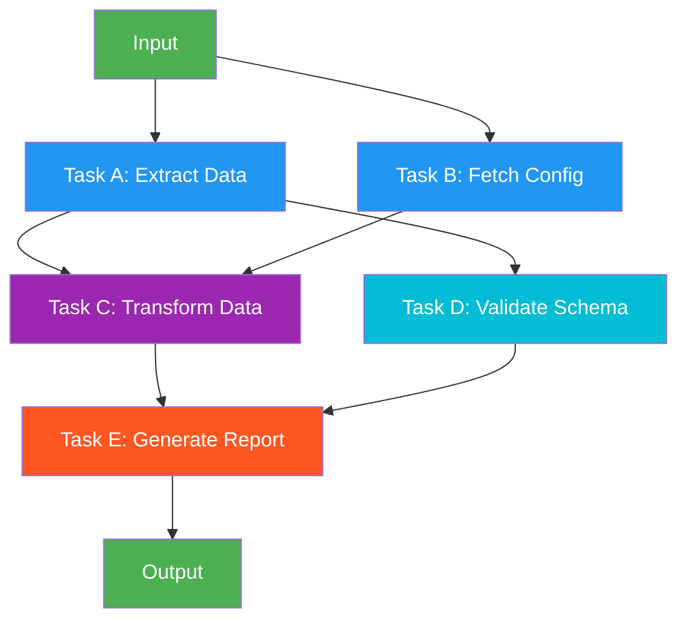

# 16. DAG / Graph-Based Orchestration

!!! example "Mini-Project: DAG Data Pipeline"
    Executes a data processing pipeline as a dependency graph — extract and config tasks run in parallel, transform waits for both, validate runs in parallel with transform, and a final report waits for both.

    [View on GitHub :material-github:](https://github.com/saisrinivas-samoju/agentic_architectures/blob/main/mini-projects/16-dag-data-pipeline.ipynb){ .md-button .md-button--primary }

---

## Description

**DAG-based (Directed Acyclic Graph) Parallel Execution** models a workflow as a dependency graph where nodes are tasks and edges represent dependencies. Tasks without dependencies on each other run in parallel automatically, while dependent tasks wait for their predecessors. This generalizes both sequential chains and parallel fan-out into a single, flexible execution model.

LangGraph natively supports DAG execution — when you add multiple edges from START or define nodes with independent inputs, they execute concurrently.

## When to Use

- Complex workflows with mixed sequential and parallel steps
- When task dependencies form a natural graph (not just a chain or fan-out)
- Build systems, data pipelines, or CI/CD-like agent workflows
- When maximum concurrency is desired given dependency constraints

## Benefits

| Benefit | Description |
|---|---|
| **Maximum Concurrency** | Automatically parallelizes independent tasks |
| **Dependency Safety** | Dependent tasks always wait for prerequisites |
| **Flexibility** | Expresses any workflow topology (chain, fan-out, diamond, etc.) |
| **Visual Clarity** | DAG structure makes workflow logic explicit |

## Architecture Diagram

