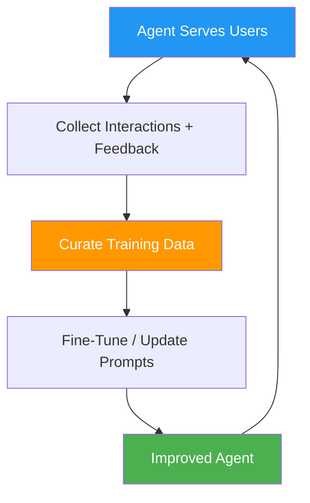

# 62. Data Flywheel / Agent-in-the-Loop

!!! example "Mini-Project: Data Flywheel: Collecting and Using Feedback"
    A feedback collection system that records agent interactions with user ratings, extracts high-quality examples for fine-tuning, identifies failure patterns, and uses production data to automatically improve the agent's system prompt.

    [View on GitHub :material-github:](https://github.com/saisrinivas-samoju/agentic_architectures/blob/main/mini-projects/62-data-flywheel.ipynb){ .md-button .md-button--primary }

---

## Description

The **Data Flywheel** pattern creates a virtuous cycle where agent interactions generate data that improves the agent, which generates better interactions, which generates better data. Human feedback, automated evaluations, and usage patterns are continuously fed back into model fine-tuning, prompt optimization, and knowledge base updates.

## How It Works

