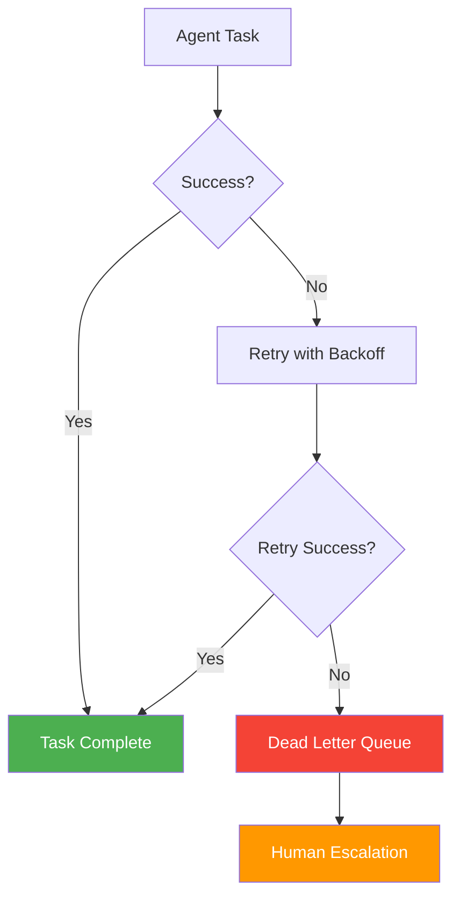

# 58. Dead Letter / Escalation Pattern

!!! example "Mini-Project: Dead Letter Queue: API Ingestion with Retry and Human Escalation"
    An API ingestion pipeline that retries failed tasks with exponential backoff, routes exhausted failures to a dead letter queue, and triggers human escalation alerts when the DLQ reaches a threshold.

    [View on GitHub :material-github:](https://github.com/saisrinivas-samoju/agentic_architectures/blob/main/mini-projects/58-dead-letter-escalation.ipynb){ .md-button .md-button--primary }

---

## Description

Prevents failed or unprocessable agent tasks from being silently lost. Ensures every task either succeeds, is retried, or is escalated to a human operator.

Failed tasks are placed in a **dead letter queue (DLQ)**. A monitoring process reviews the DLQ, attempts retries with different strategies, and if all retries fail, escalates to a human operator with full context.

## Architecture Diagram

