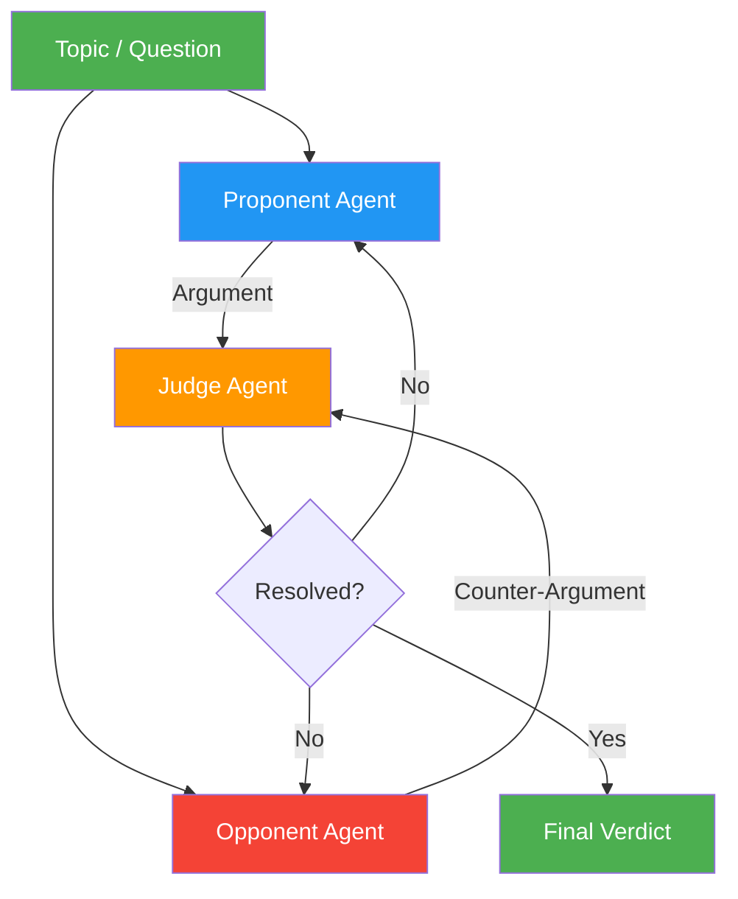

# 22. Debate / Adversarial Collaboration

!!! example "Mini-Project: Structured Debate for Decision-Making"
    A proponent and opponent agent argue for and against a proposition over multiple rounds, then an impartial judge evaluates the debate, identifies weaknesses in each side, and renders a verdict.

    [View on GitHub :material-github:](https://github.com/saisrinivas-samoju/agentic_architectures/blob/main/mini-projects/22-debate-adversarial-collaboration.ipynb){ .md-button .md-button--primary }

---

## Description

**Debate / Adversarial Collaboration** pits two or more LLM agents against each other in structured argumentation. One agent argues for a position, another argues against it (or for an alternative), and a judge agent evaluates both sides. Through multiple rounds of debate, arguments are sharpened, weaknesses exposed, and the judge converges on a well-reasoned conclusion. Research shows that debate can surface errors that neither agent would catch alone.

## When to Use

- Complex decisions where both sides have merit
- Fact verification and claim assessment
- Policy analysis requiring balanced perspectives
- When you want to expose weaknesses in reasoning

## Benefits

| Benefit | Description |
|---|---|
| **Rigor** | Arguments are stress-tested by opposition |
| **Balance** | Both sides of an issue are thoroughly explored |
| **Error Detection** | Adversarial pressure exposes flawed reasoning |
| **Depth** | Multi-round debate deepens analysis beyond single-pass |

## Architecture Diagram

