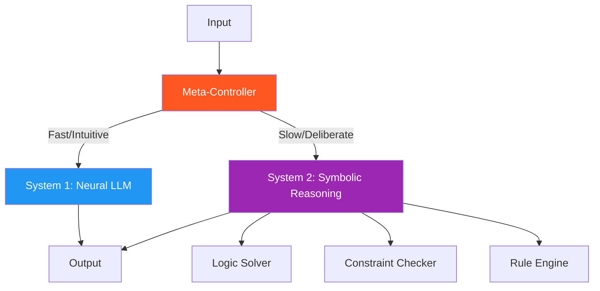

# 36. Dual-Paradigm Framework (Symbolic vs Neural)

!!! example "Mini-Project: Financial Compliance Checker"
    A dual-paradigm financial compliance system that routes open-ended policy questions to an LLM (System 1) and precise rule checks like CTR thresholds and wash-sale violations to a deterministic Python rule engine (System 2).

    [View on GitHub :material-github:](https://github.com/saisrinivas-samoju/agentic_architectures/blob/main/mini-projects/36-dual-paradigm-framework.ipynb){ .md-button .md-button--primary }

---

## Description

The **Dual-Paradigm Framework** explicitly separates an agent's reasoning into two paradigms and provides a meta-controller that decides which paradigm to use for each sub-task. The **System 1** (neural/fast) path handles intuitive, pattern-matching tasks using the LLM directly. The **System 2** (symbolic/slow) path handles deliberate, logical tasks using formal reasoning tools. This mirrors Kahneman's dual-process theory of human cognition.

## Core Components

## When to Use

- Systems handling a mix of intuitive and analytical tasks
- When you want to optimize compute by routing appropriately
- Applications requiring both conversational AI and formal verification
- When you want an explicit System 1/System 2 architecture
