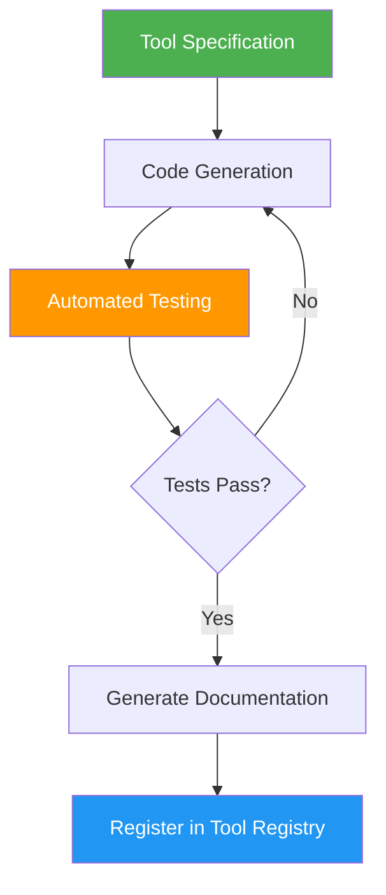

# 34. Dynamic Tool Generation (ToolFactory)

!!! example "Mini-Project: ToolFactory"
    A systematic tool factory that takes a formal specification (name, description, input/output types, test cases), generates code with an LLM, runs all tests, and registers the tool only if every test passes — retrying with error feedback on failure.

    [View on GitHub :material-github:](https://github.com/saisrinivas-samoju/agentic_architectures/blob/main/mini-projects/34-dynamic-tool-generation.ipynb){ .md-button .md-button--primary }

---

## Description

**Dynamic Tool Generation (ToolFactory)** is a systematic pattern for creating, testing, and deploying new tools at runtime. Unlike Self-Tooling (ad-hoc tool creation), ToolFactory includes a formal pipeline: specification, code generation, testing, documentation, and registration. This ensures generated tools are reliable and well-documented.

## How It Works

