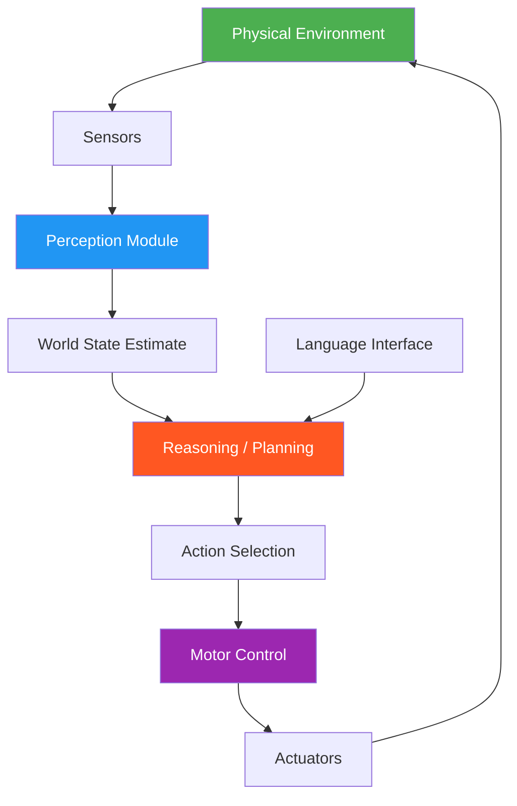

# 64. Embodied AI

!!! example "Mini-Project: Embodied AI: Grid Navigation with BFS Pathfinding and Dynamic Replanning"
    A sense-plan-act loop that navigates a grid world using BFS pathfinding, handles dynamic obstacles appearing mid-execution by replanning from the current position, and escalates to human assistance when no viable path exists.

    [View on GitHub :material-github:](https://github.com/saisrinivas-samoju/agentic_architectures/blob/main/mini-projects/64-embodied-ai.ipynb){ .md-button .md-button--primary }

---

## Description

**Embodied AI** refers to AI agents that interact with the physical world through sensors and actuators -- robots, drones, autonomous vehicles, or smart devices. Unlike purely digital agents, embodied agents must handle continuous state spaces, real-time constraints, physical safety, and sensor noise. They combine perception (vision, LIDAR, touch), reasoning (planning, navigation), and action (motor control) in a closed loop.

## Architecture Diagram

## Key Models/Systems

| System | Domain | Description |
|---|---|---|
| **Boston Dynamics Spot** | Quadruped Robot | Autonomous navigation and manipulation |
| **Tesla FSD** | Autonomous Driving | Vision-based self-driving |
| **Google Aloha** | Manipulation | Bimanual robotic manipulation |
| **Figure 01** | Humanoid | General-purpose humanoid robot |
