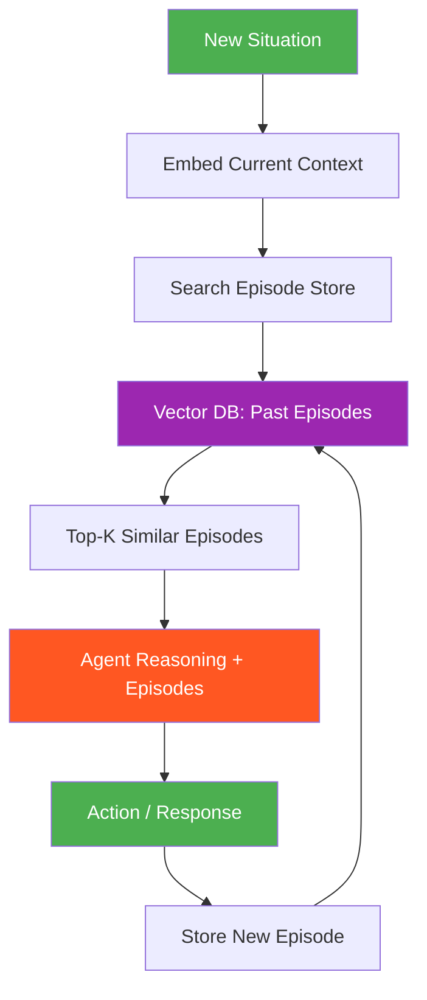

# 46. Episodic Memory

!!! example "Mini-Project: Episodic Memory"
    An episodic memory system for a support agent that stores timestamped experience records (situation, action, outcome), retrieves the most relevant past episodes using semantic similarity combined with recency weighting, and uses them to suggest diagnoses for new incidents.

    [View on GitHub :material-github:](https://github.com/saisrinivas-samoju/agentic_architectures/blob/main/mini-projects/46-episodic-memory.ipynb){ .md-button .md-button--primary }

---

## What It Is

**Episodic Memory** stores specific past experiences that an agent has had, including the context, actions taken, outcomes, and lessons learned. Each episode is a timestamped record of a complete interaction. When facing a new situation, the agent retrieves similar past episodes to inform its decisions -- like a human recalling "Last time I debugged a similar error, the issue was in the config file."

## What It Stores (Examples)

- Complete conversation transcripts with outcomes
- Task execution traces (steps taken, results, success/failure)
- Error recovery episodes (what went wrong, how it was fixed)
- User preferences observed over time

## How It's Implemented

Uses a **vector database** for semantic similarity search. Each episode is embedded as a vector, and retrieval finds the most similar past experiences.

## Mermaid Diagram

