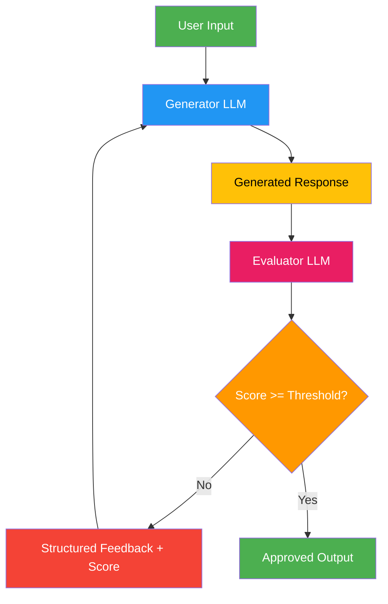

# 8. Evaluator-Optimizer

!!! example "Mini-Project: Audience-Adaptive Content Optimizer"
    A generator-evaluator loop that adapts content to a target audience, scoring readability and relevance until a quality threshold is met.

    [View on GitHub :material-github:](https://github.com/saisrinivas-samoju/agentic_architectures/blob/main/mini-projects/08-audience-adaptive-content-optimizer.ipynb){ .md-button .md-button--primary }

---

## Description

The **Evaluator-Optimizer** pattern separates generation and evaluation into two distinct LLM roles that operate in a loop. The **Generator** produces a response, and the **Evaluator** scores it against defined criteria and provides structured feedback. The loop continues until the evaluator's score exceeds a threshold or a maximum number of iterations is reached. This differs from Reflection in that the evaluator provides **structured scoring** rather than just textual feedback.

## When to Use

- When you have clear, quantifiable evaluation criteria (accuracy, completeness, format)
- Tasks where quality can be scored numerically
- Content that must meet specific standards before release
- When iterative refinement provides measurable, demonstrable value

## Benefits

| Benefit | Description |
|---|---|
| **Measurable Quality** | Numeric scoring tracks improvement objectively |
| **Structured Feedback** | Evaluator provides actionable, criteria-specific guidance |
| **Threshold Control** | Define minimum quality bars |
| **Separation of Concerns** | Generator and evaluator can use different prompts or models |

## Architecture Diagram

