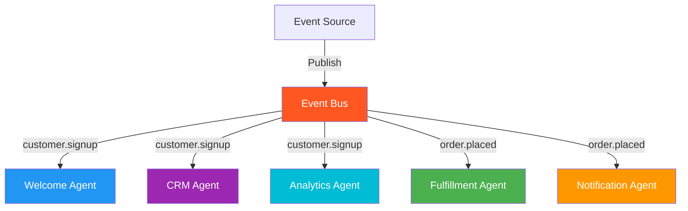

# 26. Event-Driven Multi-Agent Architecture

!!! example "Mini-Project: Event-Driven Agent System"
    An event bus coordinates agents (welcome, analytics, onboarding, loyalty) that subscribe to customer lifecycle events, reacting in parallel whenever an event fires — new subscribers can be added without changing existing code.

    [View on GitHub :material-github:](https://github.com/saisrinivas-samoju/agentic_architectures/blob/main/mini-projects/26-event-driven-multi-agent.ipynb){ .md-button .md-button--primary }

---

## Description

**Event-Driven Multi-Agent Architecture** uses an event bus (or message queue) to coordinate agents. Instead of direct invocation, agents publish events and subscribe to event types they care about. When an event is published, all subscribed agents react independently. This creates loose coupling — agents don't need to know about each other, only about event types.

This pattern is ideal for reactive systems where multiple agents need to respond to the same events (e.g., a new customer signup triggers welcome email, CRM update, analytics tracking, and onboarding flow simultaneously).

## When to Use

- Systems where multiple agents must react to the same events
- When loose coupling between agents is essential
- Real-time reactive pipelines (monitoring, alerting, streaming)
- When adding new agents should not require modifying existing ones

## Benefits

| Benefit | Description |
|---|---|
| **Loose Coupling** | Agents communicate via events, not direct calls |
| **Scalability** | Add new subscribers without changing publishers |
| **Reactivity** | Real-time response to events |
| **Resilience** | Failure of one subscriber doesn't affect others |

## Architecture Diagram

