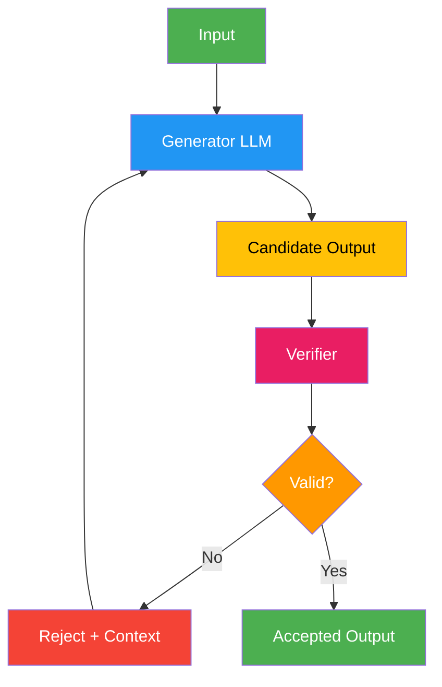

# 11. Generator-Verifier (Generator-Discriminator)

!!! example "Mini-Project: SQL Generator with Execution Verifier"
    A generator LLM writes SQL queries to answer natural-language questions, and a verifier executes each query against a live SQLite database, routing failures back to the generator with error context until the query succeeds.

    [View on GitHub :material-github:](https://github.com/saisrinivas-samoju/agentic_architectures/blob/main/mini-projects/11-sql-generator-verifier.ipynb){ .md-button .md-button--primary }

---

## Description

The **Generator-Verifier** pattern pairs a generation model with a separate verification model. The generator produces candidate outputs, and the verifier independently assesses whether each candidate is correct, safe, or meets quality criteria. Unlike Reflection (which provides textual feedback for iteration), the verifier acts as a **binary or scored gate** — outputs either pass or fail. Failed outputs are regenerated, sometimes with the verification failure as context.

This mirrors the GAN (Generative Adversarial Network) concept at the agent level: one model creates, another judges.

## When to Use

- Code generation where output can be verified by execution
- Mathematical reasoning where answers can be checked
- Content moderation (generate then verify for safety)
- Any task with a cheap-to-compute verification function

## Benefits

| Benefit | Description |
|---|---|
| **High Accuracy** | Verification catches generation errors |
| **Separation of Concerns** | Generator and verifier can be different models |
| **Efficient** | Verifier is often cheaper than regeneration |
| **Composable** | Multiple verifiers can be chained (safety, accuracy, format) |

## Architecture Diagram

