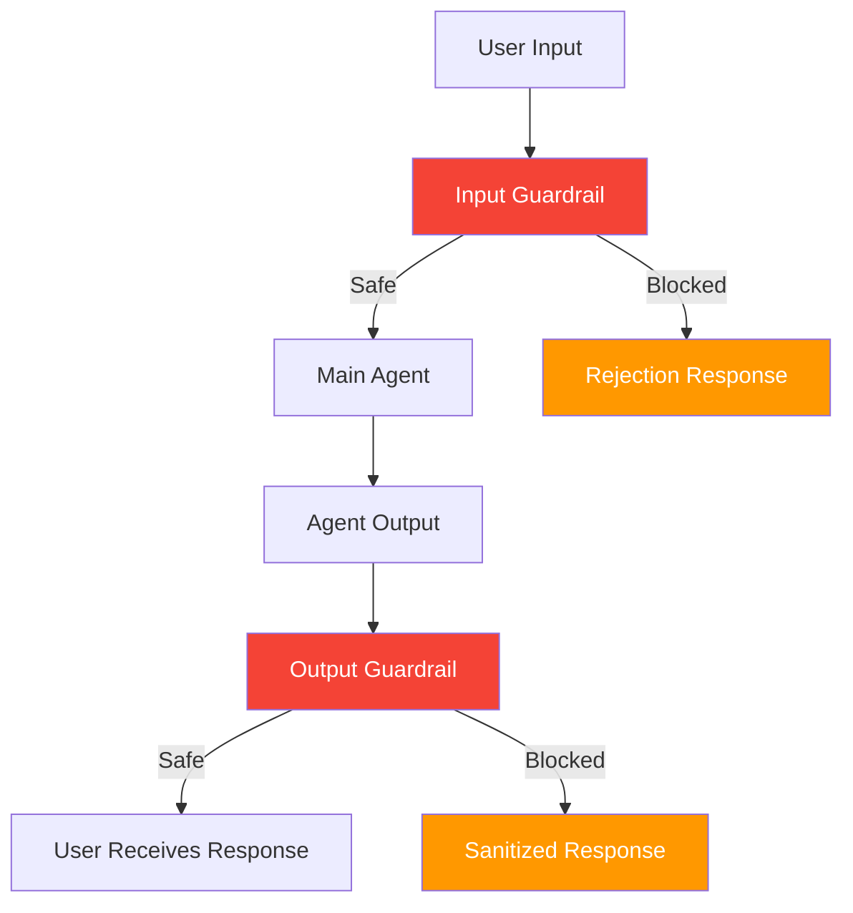
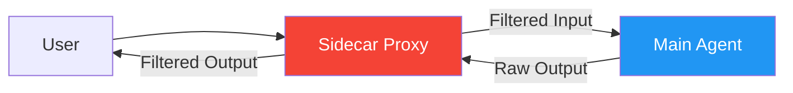

# 53. Guardrail Agent (Constitutional Filter)

!!! example "Mini-Project: Constitutional Guardrail Agent"
    A two-layer safety filter that wraps a main agent with an input guardrail and output guardrail, blocking harmful or policy-violating requests before they reach the user.

    [View on GitHub :material-github:](https://github.com/saisrinivas-samoju/agentic_architectures/blob/main/mini-projects/53-guardrail-agent.ipynb){ .md-button .md-button--primary }

---

## Description

A **Guardrail Agent** acts as a filter between the main agent and the user. It evaluates every input and output against a set of rules (a "constitution") and blocks, modifies, or flags violations. This can be implemented as a pre-processor (input guard), post-processor (output guard), or both.

Prevents harmful, biased, off-topic, or policy-violating outputs from reaching users. Guards against prompt injection, jailbreaks, and unintended content generation.

## Architecture Diagram

## Extended: Sidecar Guardrail Pattern

A lightweight "sidecar" process runs alongside the main agent, intercepting all inputs and outputs. The sidecar applies guardrail checks independently, similar to how sidecar proxies (Envoy, Istio) work in microservices. Useful when you cannot change the agent's code but need to add safety checks (e.g., third-party agents, legacy systems).

