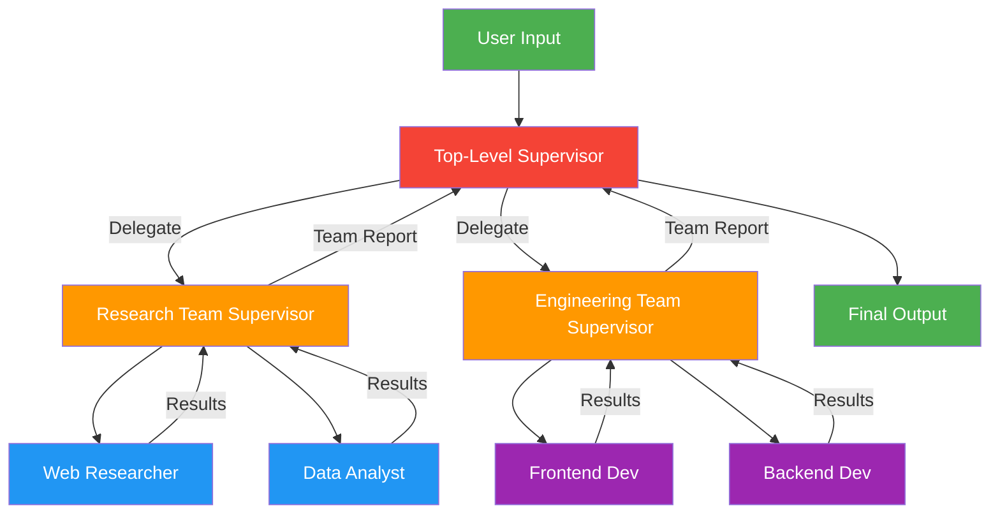

# 10. Hierarchical Multi-Agent Teams

!!! example "Mini-Project: Full-Stack Project Builder"
    A hierarchical team where a top-level supervisor coordinates a research team and an engineering team to design and implement a full-stack application.

    [View on GitHub :material-github:](https://github.com/saisrinivas-samoju/agentic_architectures/blob/main/mini-projects/10-full-stack-project-builder.ipynb){ .md-button .md-button--primary }

---

## Description

**Hierarchical Multi-Agent Teams** extend the Supervisor pattern by nesting multiple supervisors into a tree structure. A top-level supervisor delegates to mid-level supervisors, each of which manages their own team of specialized worker agents. This mirrors how large organizations structure teams with managers and sub-teams.

## When to Use

- Large-scale, multi-domain tasks requiring many specialized agents
- When a single supervisor would be overloaded with too many workers
- Projects requiring both research AND implementation teams
- Enterprise workflows with clear team boundaries and responsibilities

## Benefits

| Benefit | Description |
|---|---|
| **Scalability** | Manage dozens of agents through hierarchical delegation |
| **Team Autonomy** | Each sub-team operates independently within its domain |
| **Reduced Complexity** | Each supervisor manages only a few direct reports |
| **Composability** | Teams can be assembled from reusable sub-team modules |

## Architecture Diagram

