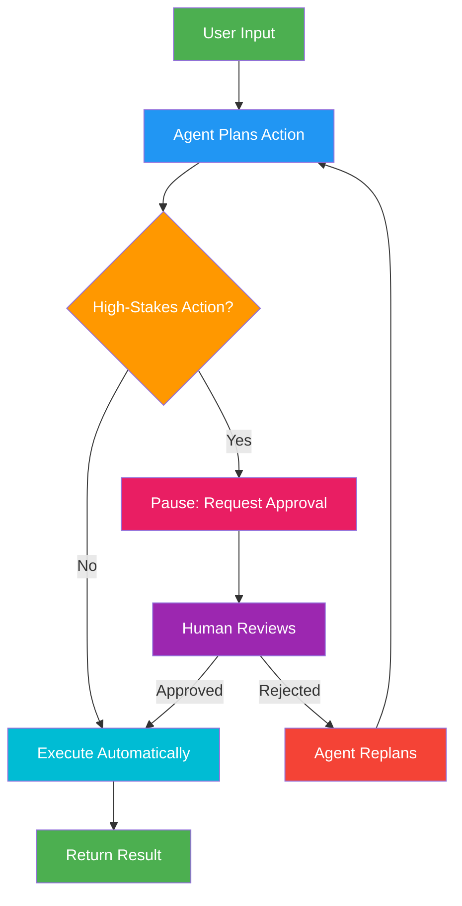

# 13. Human-in-the-Loop (HITL)

!!! example "Mini-Project: Expense Approval with Human-in-the-Loop"
    An expense approval agent that auto-approves low-value requests and pauses for human review on high-value ones, using LangGraph's interrupt mechanism to capture the human decision before resuming.

    [View on GitHub :material-github:](https://github.com/saisrinivas-samoju/agentic_architectures/blob/main/mini-projects/13-expense-approval-hitl.ipynb){ .md-button .md-button--primary }

---

## Description

**Human-in-the-Loop (HITL)** integrates human oversight into an agent's execution flow. At critical decision points, the agent pauses and requests human approval, input, or correction before proceeding. This is essential for high-stakes operations (financial transactions, data deletion, sending emails) where autonomous execution is too risky. LangGraph supports HITL natively through **interrupt points** and checkpointers that persist state while waiting for human input.

## When to Use

- High-stakes actions (payments, deletions, external communications)
- When agent confidence is low and human judgment adds value
- Compliance requirements mandating human approval
- Iterative workflows where human feedback steers the agent

## Benefits

| Benefit | Description |
|---|---|
| **Safety** | Prevents costly autonomous mistakes |
| **Trust** | Users maintain control over critical decisions |
| **Quality** | Human judgment supplements LLM reasoning |
| **Compliance** | Meets regulatory requirements for human oversight |

## Architecture Diagram

