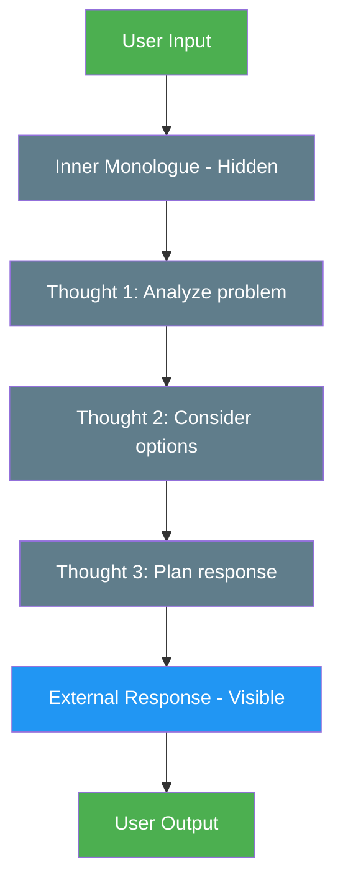

# 27. Inner Monologue

!!! example "Mini-Project: Inner Monologue Agent for Customer Support"
    A customer support agent maintains a private reasoning scratchpad to analyze the problem, consider edge cases, and plan its approach — then produces a clean, polished user-facing response without exposing the internal thinking.

    [View on GitHub :material-github:](https://github.com/saisrinivas-samoju/agentic_architectures/blob/main/mini-projects/27-inner-monologue.ipynb){ .md-button .md-button--primary }

---

## Description

**Inner Monologue** gives an agent an explicit internal reasoning space that is separate from its external output. The agent maintains a "thought" stream where it reasons about the problem, evaluates options, and plans its next action — but this stream is not shown to the user. Only the final, polished response is visible externally. This contrasts with chain-of-thought prompting where reasoning is interleaved with the output.

Inner monologue enables more sophisticated reasoning without cluttering the user-facing response with intermediate thoughts.

## When to Use

- When agents need to reason extensively but users want clean output
- Complex decision-making requiring internal deliberation
- When you want to log reasoning for debugging without exposing it
- Tasks where showing reasoning would be confusing to end users

## Benefits

| Benefit | Description |
|---|---|
| **Clean Output** | Users see only the polished final response |
| **Deep Reasoning** | Agent can think extensively without output constraints |
| **Debuggability** | Internal thoughts are logged for analysis |
| **Flexibility** | Reasoning format doesn't need to be user-friendly |

## Architecture Diagram

