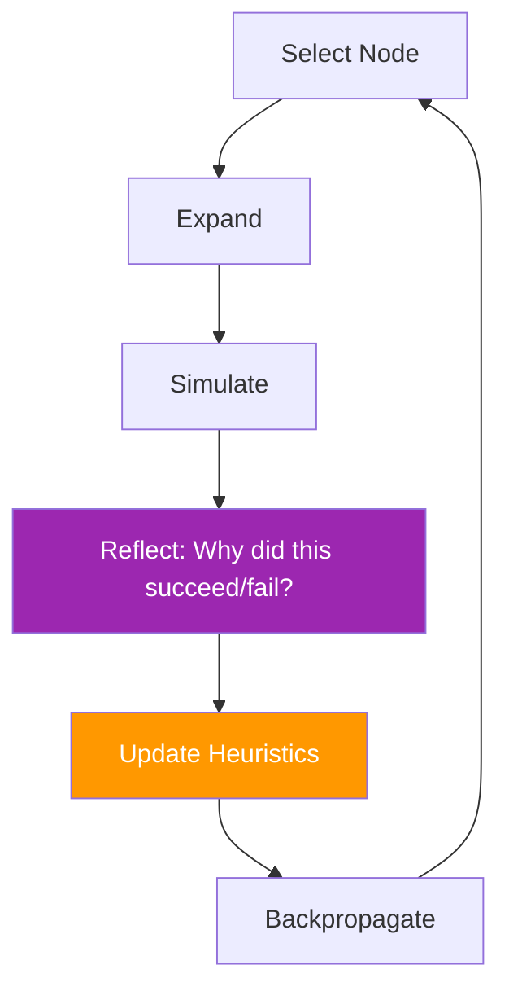

# 38. Introspective MCTS (I-MCTS)

!!! example "Mini-Project: Introspective MCTS"
    An MCTS variant that adds a self-reflection step after each simulation — comparing sibling nodes to extract insights, then feeding those insights into future expansions to progressively bias the search toward more promising paths.

    [View on GitHub :material-github:](https://github.com/saisrinivas-samoju/agentic_architectures/blob/main/mini-projects/38-introspective-mcts.ipynb){ .md-button .md-button--primary }

---

## Description

**Introspective MCTS (I-MCTS)** adds self-reflection to the MCTS search process. After each simulation, the agent reflects on why certain paths succeeded or failed and uses those insights to guide future search. This introspective step biases the search toward more promising areas based on learned reasoning patterns, not just statistical value estimates.

## How It Works

Standard MCTS + an introspection step after each simulation that generates a "lesson learned" and adjusts the heuristic used for selection and expansion.

## Diagram

