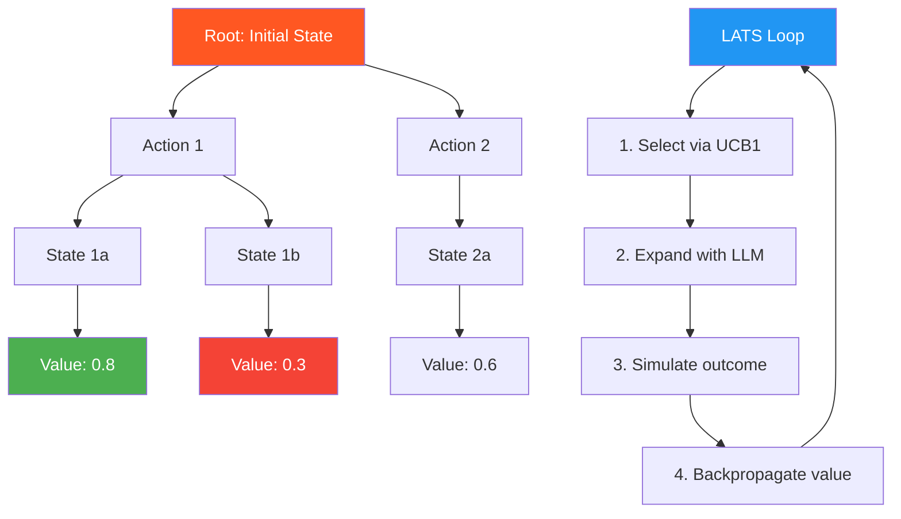

# 37. Language Agent Tree Search (LATS)

!!! example "Mini-Project: LATS"
    An MCTS-style tree search where the LLM proposes candidate next steps, scores partial solutions, and UCB1 selection balances exploration vs exploitation to find the best solution path.

    [View on GitHub :material-github:](https://github.com/saisrinivas-samoju/agentic_architectures/blob/main/mini-projects/37-lats.ipynb){ .md-button .md-button--primary }

---

## Description

**LATS** (Zhou et al., 2023) combines LLM-based agents with Monte Carlo Tree Search (MCTS). The agent builds a search tree where each node is a state (observation), and each edge is an action. LATS uses the LLM for four roles: (1) generating candidate actions, (2) evaluating states, (3) simulating outcomes, and (4) backpropagating values. This enables systematic exploration of large action spaces.

## How It Works (Algorithm)

1. **Selection**: Navigate the tree using UCB1 (Upper Confidence Bound) to balance exploration vs exploitation
2. **Expansion**: Use the LLM to generate candidate actions from the current state
3. **Simulation**: Use the LLM to simulate the outcome of each action
4. **Backpropagation**: Update node values based on simulation results

## Diagram

