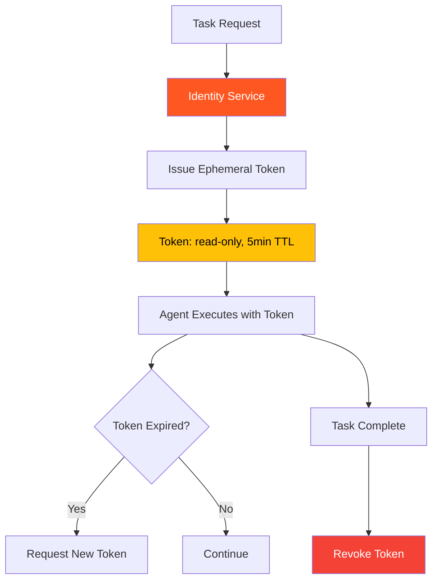

# 57. Least-Privilege Ephemeral Identity

!!! example "Mini-Project: Ephemeral Identity for Agent Tasks"
    An identity service that issues scoped, time-limited tokens to agents for each task execution, with automatic expiry and explicit revocation to enforce least-privilege access.

    [View on GitHub :material-github:](https://github.com/saisrinivas-samoju/agentic_architectures/blob/main/mini-projects/57-least-privilege-ephemeral-identity.ipynb){ .md-button .md-button--primary }

---

## Description

Prevents over-privileged agents from causing damage beyond their task scope. If an agent is compromised or makes an error, the blast radius is limited to only the permissions it was granted for that specific task.

Each agent task execution receives a **temporary, scoped identity token** with the minimum permissions needed. The token expires after task completion. This follows the principle of least privilege applied to agent systems.

## Architecture Diagram

