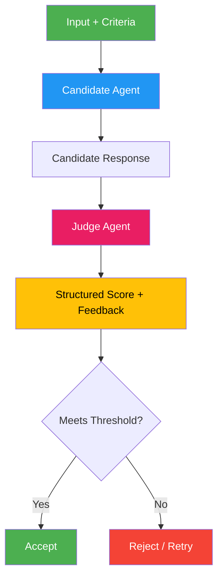

# 12. Agent-as-a-Judge (LLM-as-a-Judge)

!!! example "Mini-Project: LLM-as-a-Judge Evaluator"
    Uses a stronger LLM as a judge to evaluate and score candidate responses against a detailed rubric, and then performs comparative A/B judgment between multiple candidates.

    [View on GitHub :material-github:](https://github.com/saisrinivas-samoju/agentic_architectures/blob/main/mini-projects/12-llm-as-a-judge.ipynb){ .md-button .md-button--primary }

---

## Description

**Agent-as-a-Judge** uses one LLM agent to evaluate the output of another agent (or system) against predefined criteria. The judge agent applies rubrics, scoring guidelines, or constitutional principles to assess quality, safety, accuracy, or adherence to instructions. This pattern is crucial for automated evaluation of LLM outputs at scale, replacing expensive human evaluation.

Research (Zheng et al., 2023) shows that strong LLM judges (GPT-4, Claude) achieve 80%+ agreement with human annotators, making this viable for production quality assurance.

## When to Use

- Automated evaluation of LLM-generated content
- A/B testing different prompts or models
- Quality assurance in content pipelines
- Scoring and ranking candidate responses

## Benefits

| Benefit | Description |
|---|---|
| **Scalability** | Evaluate thousands of outputs without human reviewers |
| **Consistency** | Same rubric applied uniformly to all outputs |
| **Speed** | Instant evaluation vs. days for human review |
| **Customizable** | Rubrics can be tailored to any domain |

## Architecture Diagram

