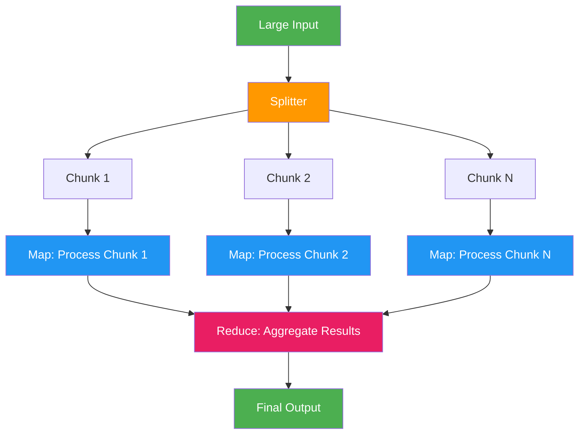

# 14. Map-Reduce Agents

!!! example "Mini-Project: Long Document Summarizer"
    Splits a long document into overlapping chunks, summarizes each chunk in parallel (map), then synthesizes all chunk summaries into a coherent final summary (reduce).

    [View on GitHub :material-github:](https://github.com/saisrinivas-samoju/agentic_architectures/blob/main/mini-projects/14-long-document-summarizer.ipynb){ .md-button .md-button--primary }

---

## Description

**Map-Reduce Agents** apply the classic MapReduce paradigm to LLM processing. A large input (long document, multiple files, dataset) is split into chunks, each chunk is processed independently by a "mapper" LLM call (the Map phase), and the results are combined by a "reducer" LLM call (the Reduce phase). This is ideal for processing inputs that exceed context windows or benefit from parallel analysis.

## When to Use

- Summarizing very long documents that exceed context limits
- Analyzing multiple documents or data sources in parallel
- Extracting structured data from large unstructured datasets
- Any task where "divide and conquer" improves quality or overcomes limits

## Benefits

| Benefit | Description |
|---|---|
| **Scalability** | Handle arbitrarily large inputs by chunking |
| **Parallelism** | Map phase runs concurrently for speed |
| **Context Fit** | Each chunk fits within the LLM context window |
| **Quality** | Focused analysis per chunk, then intelligent aggregation |

## Architecture Diagram

