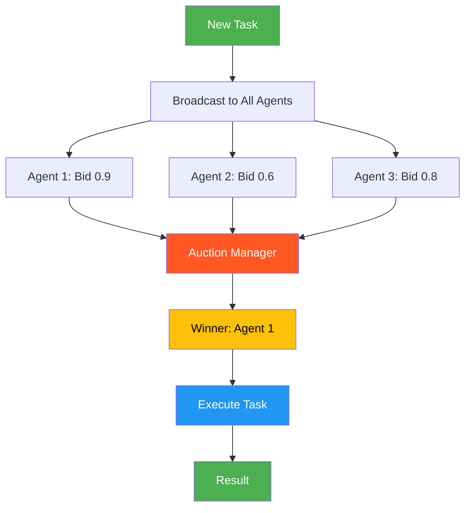

# 20. Market-Based / Bidding Pattern

!!! example "Mini-Project: Market-Based Task Allocation System"
    Broadcasts a task to a pool of agents (data scientist, web developer, technical writer), each bids based on skill match and availability, and a weighted auction selects the winner to execute the task.

    [View on GitHub :material-github:](https://github.com/saisrinivas-samoju/agentic_architectures/blob/main/mini-projects/20-market-based-bidding.ipynb){ .md-button .md-button--primary }

---

## Description

The **Market-Based / Bidding Pattern** treats task allocation as an auction. When a new task arrives, it is broadcast to all available agents. Each agent evaluates the task against its capabilities and submits a "bid" (a score reflecting its suitability and availability). The highest-bidding agent wins the task. This creates a self-organizing system where tasks naturally flow to the best-suited agents without centralized assignment.

## When to Use

- Dynamic task allocation in systems with heterogeneous agents
- When agent suitability varies by task type and current load
- Load balancing across a pool of agents
- When you want decentralized, market-driven coordination

## Benefits

| Benefit | Description |
|---|---|
| **Self-Organizing** | Tasks flow to the most suitable agents |
| **Load Balancing** | Busy agents bid lower, distributing work naturally |
| **Extensible** | New agents join by participating in auctions |
| **Efficient** | No central bottleneck in task allocation |

## Architecture Diagram

