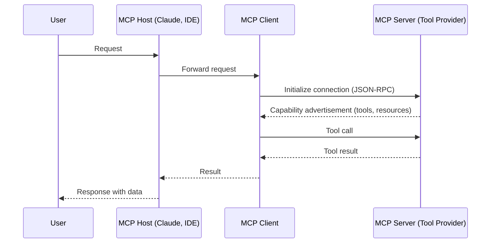

# 42. Model Context Protocol (MCP)

!!! example "Mini-Project: Simulated MCP Server: Exposing a Weather Tool"
    A FastMCP server that exposes weather lookup and comparison tools via the Model Context Protocol, demonstrating how any MCP-compatible client can discover and call these tools without custom integration code.

    [View on GitHub :material-github:](https://github.com/saisrinivas-samoju/agentic_architectures/blob/main/mini-projects/42-mcp.py){ .md-button .md-button--primary }

---

## What It Is

The **Model Context Protocol (MCP)** is an open standard created by Anthropic that provides a universal way for AI models to connect to external data sources and tools. MCP defines a client-server architecture where an MCP client (the AI application) communicates with MCP servers (tool/data providers) using a standardized JSON-RPC protocol. This allows any MCP-compatible AI model to use any MCP-compatible tool without custom integration code.

MCP solves the "N x M" integration problem: instead of building custom integrations between N models and M tools, each model implements one MCP client and each tool implements one MCP server.

## Who Created It / Governed By

Created by **Anthropic** (November 2024). Open-source specification hosted on GitHub. Rapidly adopted by the ecosystem -- supported by Claude, Cursor, Windsurf, and many tool providers.

## How It Works

## Key Features

| Feature | Description |
|---|---|
| **Tools** | Server exposes callable functions with JSON schemas |
| **Resources** | Server exposes read-only data (files, DB records) |
| **Prompts** | Server provides pre-built prompt templates |
| **Transport** | Supports stdio (local) and HTTP+SSE (remote) |
| **Discovery** | Client discovers server capabilities dynamically |
| **Security** | User consent required for tool execution |
