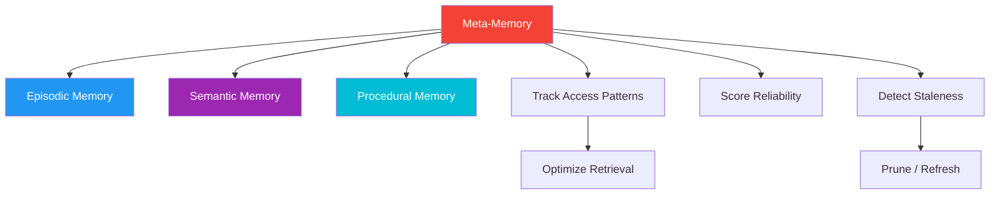

# 52. Meta-Memory

!!! example "Mini-Project: Meta-Memory System"
    A higher-level memory system that monitors and manages other memory modules by tracking access patterns, reliability scores, and staleness to optimize retrieval and prune unreliable memories.

    [View on GitHub :material-github:](https://github.com/saisrinivas-samoju/agentic_architectures/blob/main/mini-projects/52-meta-memory.ipynb){ .md-button .md-button--primary }

---

## Description

**Meta-Memory** is memory about memory -- a higher-level system that monitors, manages, and optimizes all other memory systems. It tracks which memories are useful, stale, or unreliable, and adjusts retrieval strategies accordingly. Meta-memory enables self-reflection: "What do I know? What don't I know? Which memories are trustworthy?"

## What It Stores

- Memory access patterns and frequency
- Memory reliability scores (correlation with good outcomes)
- Staleness indicators
- Knowledge gaps

## How It's Implemented

Uses a **metadata layer** on top of other memory systems, tracking access counts, success correlation, and freshness.

## Architecture Diagram

