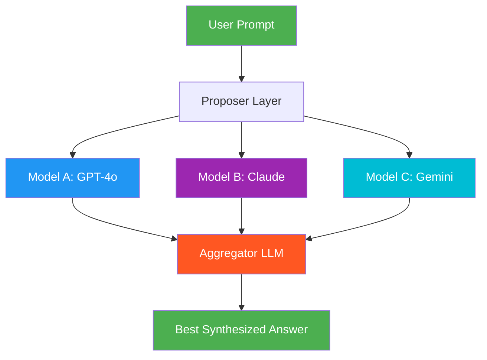

# 15. Mixture-of-Agents (MoA)

!!! example "Mini-Project: Mixture of Agents Analysis"
    Runs a product launch assessment through three persona-driven proposer agents (optimist, skeptic, pragmatist) in parallel, then synthesizes their divergent views into a balanced recommendation.

    [View on GitHub :material-github:](https://github.com/saisrinivas-samoju/agentic_architectures/blob/main/mini-projects/15-mixture-of-agents-analysis.ipynb){ .md-button .md-button--primary }

---

## Description

**Mixture-of-Agents (MoA)** runs the same prompt through multiple diverse LLMs in parallel (the "proposer" layer), then feeds all their outputs to an "aggregator" LLM that synthesizes the best answer. This leverages the complementary strengths of different models — one may be better at reasoning, another at creativity, another at factual accuracy. Research from Together AI shows that MoA can outperform any individual model, including GPT-4, on benchmarks.

The pattern can be extended to multiple layers, where the outputs of one layer of proposers become inputs to the next layer.

## When to Use

- High-stakes tasks where quality matters more than cost
- When no single model excels at all aspects of the task
- Benchmark-critical applications requiring maximum accuracy
- Tasks combining creativity, reasoning, and factual precision

## Benefits

| Benefit | Description |
|---|---|
| **Superior Quality** | Ensemble output exceeds any individual model |
| **Diversity** | Different models catch different errors |
| **Robustness** | Less susceptible to individual model biases |
| **Flexibility** | Swap models in/out without changing the architecture |

## Architecture Diagram

