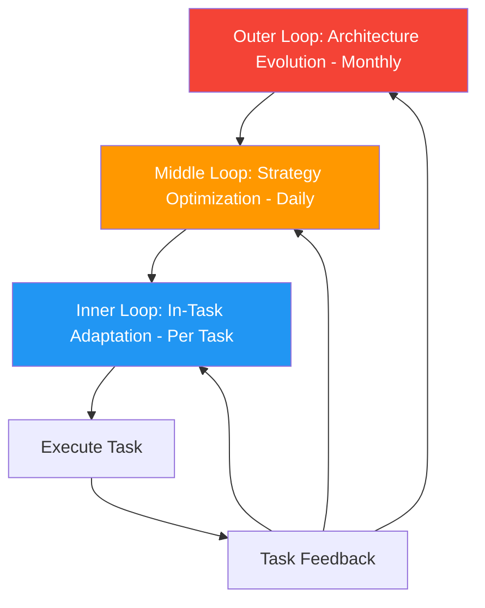

# 70. Nested Learning

!!! example "Mini-Project: Nested Learning: 3 Loops Where Each Level's Output Changes the Next Iteration's Behavior"
    A three-level learning system where an inner loop retries low-scoring answers with chain-of-thought, a middle loop permanently adds CoT to the prompt when it consistently helps, and an outer loop adds a calculator tool when performance plateaus across epochs.

    [View on GitHub :material-github:](https://github.com/saisrinivas-samoju/agentic_architectures/blob/main/mini-projects/70-nested-learning.ipynb){ .md-button .md-button--primary }

---

## Description

**Nested Learning** creates a hierarchy of learning loops operating at different time scales. The **inner loop** (fast) optimizes within a single task (e.g., prompt refinement during execution). The **middle loop** (medium) optimizes across tasks (e.g., updating strategies based on daily performance). The **outer loop** (slow) optimizes the agent architecture itself (e.g., monthly review of tool selection and workflow design).

## How It Works

