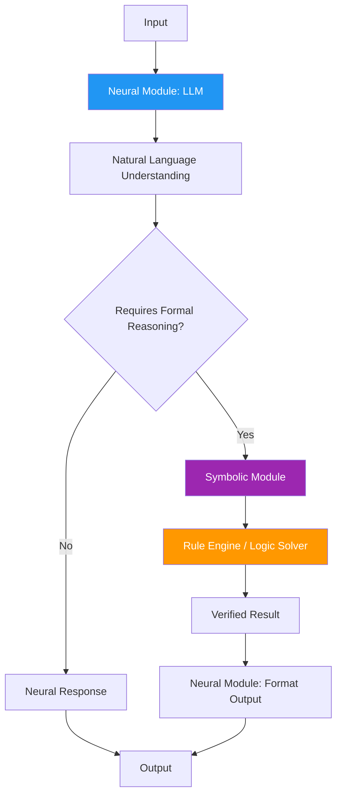

# 35. Neuro-Symbolic Agent Architecture

!!! example "Mini-Project: Neuro-Symbolic Agent: Tax Calculator"
    A neuro-symbolic agent that uses the LLM to parse natural language tax questions and extract income amounts, then delegates to a deterministic symbolic tax engine to compute precise bracket-by-bracket results.

    [View on GitHub :material-github:](https://github.com/saisrinivas-samoju/agentic_architectures/blob/main/mini-projects/35-neuro-symbolic-agent.ipynb){ .md-button .md-button--primary }

---

## Description

**Neuro-Symbolic Agent Architecture** combines neural networks (LLMs) for perception, language understanding, and creative reasoning with symbolic systems (rule engines, logic solvers, knowledge graphs) for precise reasoning, constraint enforcement, and verifiable logic. The neural component handles ambiguity and natural language; the symbolic component handles exactness and formal rules.

## Core Components

## When to Use

- Tasks requiring both natural language understanding AND formal reasoning
- Legal, financial, or medical domains with strict rules
- When LLM "hallucination" on factual/logical tasks is unacceptable
- Systems combining conversational interfaces with backend rule engines
