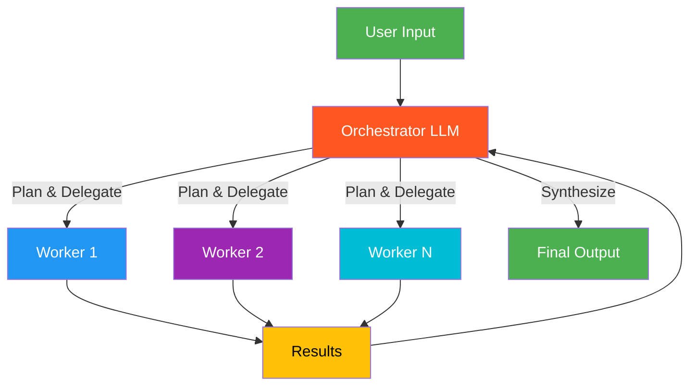

# 5. Orchestrator-Worker

!!! example "Mini-Project: Competitive Intelligence Report Generator"
    An orchestrator that dynamically plans and dispatches research workers to gather and synthesize competitive intelligence on companies.

    [View on GitHub :material-github:](https://github.com/saisrinivas-samoju/agentic_architectures/blob/main/mini-projects/05-competitive-intelligence-report-generator.ipynb){ .md-button .md-button--primary }

---

## Description

In the **Orchestrator-Worker** pattern, a central orchestrator LLM dynamically breaks down a task into subtasks, delegates them to worker LLMs, and synthesizes their results. Unlike Parallelization (where subtasks are pre-defined), the orchestrator **dynamically determines** what subtasks are needed based on the specific input.

## When to Use

- Complex tasks where subtasks cannot be predicted in advance
- Coding tasks that require changes across multiple files
- Research tasks that need adaptive exploration strategies
- When the decomposition itself requires intelligence

## Benefits

| Benefit | Description |
|---|---|
| **Adaptability** | Subtask decomposition is dynamic, not hardcoded |
| **Scalability** | Can spawn as many workers as needed |
| **Intelligence** | Orchestrator applies reasoning to task breakdown |
| **Synthesis** | Final output integrates all worker contributions |

## Architecture Diagram

